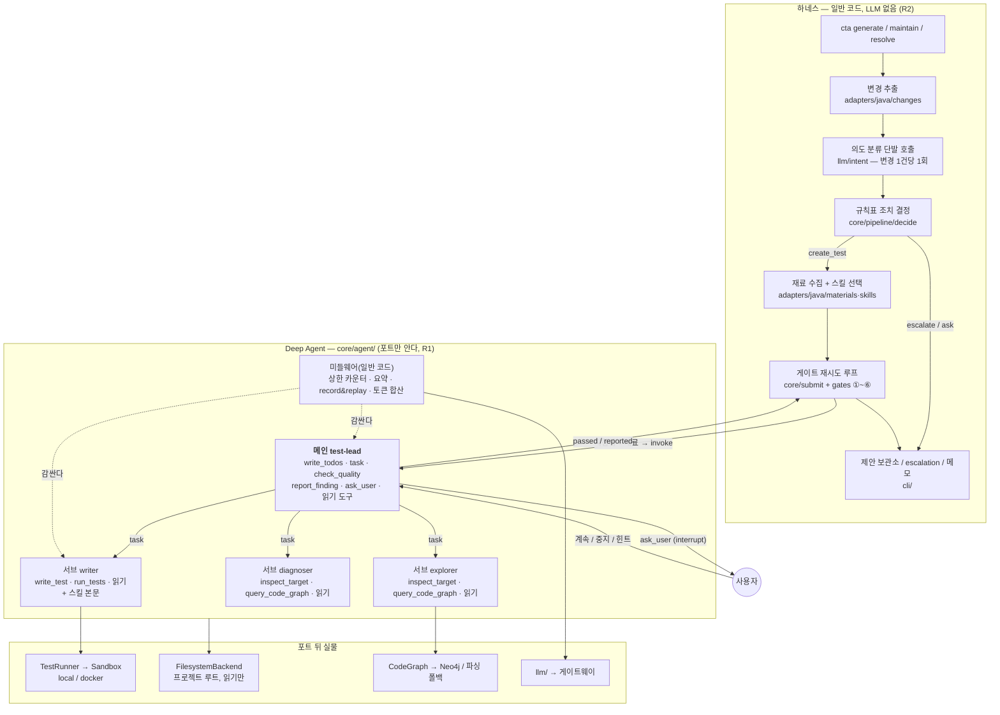
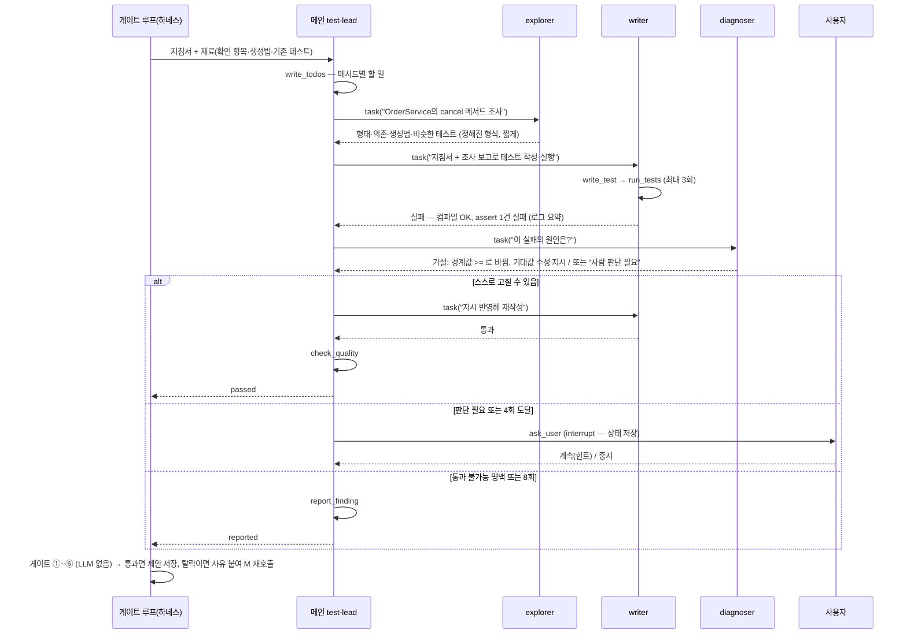

# Deep Agents 전환안 — 메인 에이전트 + 서브에이전트 구조로 다시 짜기

작성일: 2026-09-08. 상태: **승인·구현 중** — 결정은 ADR-0024·0025, 진행 상태는 §9.
근거 문서: `docs/02_상세설계_및_개발환경구축_v4.md`(v4), `docs/architecture.md`, `docs/contracts.md`, ADR-0012·0016·0017·0023,
LangChain Deep Agents 공식 문서(2026-09 기준, `deepagents` 파이썬 패키지).

## 0. 한 줄 결론

> **가능하다. 단 "전부"가 아니라 "테스트 작성 루프와 그 조립부"를 갈아엎는 것이다.**
> 규칙표·품질 게이트·빈 selector 거부 같은 결정적 안전장치는 에이전트 **바깥**(하네스)에 그대로 남긴다.
> 그것까지 LLM 메인 에이전트에게 맡기면 R2·R3를 어기게 되고, 그 순간 이 프로젝트의 핵심 주장("사고는 규칙이 막는다")이 사라진다.

바뀌는 것과 안 바뀌는 것을 먼저 못 박는다.

| 구분 | 지금 | 전환 후 |
|---|---|---|
| 테스트 작성 루프 | `core/writer_graph.py` — 노드 6개짜리 LangGraph, 매 시도가 단발 프롬프트 | **Deep Agent** — 메인 1 + 서브 3, 도구 호출형 멀티턴 |
| 도구 | 6개를 파이썬 함수로 노드 안에서 호출 | 같은 6개를 LangChain `@tool`로 감싸 **모델이 직접 부른다** + 내장 읽기 도구 |
| 사람 개입(⏸) | `InterruptUserGate` — 노드 `ask`에서 interrupt | `ask_user` 도구 — 메인 에이전트만 보유, 같은 interrupt |
| 반복 상한(4회마다 질문·8회 하드 캡) | 그래프 상태의 숫자 | **상한 미들웨어**(일반 코드) — LLM이 못 넘는다 |
| 대화 압축 | 안 함(ADR-0016 — 단발 프롬프트라 불필요) | Deep Agents 내장 요약 미들웨어 사용 → **ADR-0016 폐기** |
| LLM 호출 통로 | `llm/` urllib 직결 + 텍스트 카세트 | `llm/`이 LangChain 모델을 만들고, **record & replay는 모델 호출 미들웨어**로 |
| 변경 추출 → 의도 분류 → 규칙표 → 게이트 | 일반 코드 + 단발 LLM 1회 | **그대로**(하네스). 에이전트에 넣지 않는다 |
| CLI 명령·제안 보관소·escalation·메모 | `cli/` | **그대로** |

## 1. Deep Agents가 무엇인가 — 우리가 쓸 부품만

Deep Agents는 LangChain이 만든 "에이전트 하네스"다. `create_deep_agent(model, tools, subagents, ...)` 한 번으로
아래 부품이 미들웨어 스택으로 조립된다. LangGraph 위에서 돌아가므로 checkpointer·interrupt는 지금과 같은 장치다.

| 부품 | 하는 일 | 우리 프로젝트에서의 쓰임 |
|---|---|---|
| `task` 도구 + 서브에이전트 | 메인이 "이 일을 해 와"라고 시키면 서브가 **새 컨텍스트**에서 일하고 **최종 보고 한 건만** 돌려준다 | 긴 탐색·긴 실패 로그를 메인 대화에서 격리 |
| 내장 파일 도구(`ls`·`read_file`·`glob`·`grep`·`write_file`·`edit_file`) | backend(실제 폴더 또는 가상)를 읽고 쓴다. `permissions`로 경로별 allow/deny/interrupt | 읽기만 허용. 쓰기는 `deny`(테스트 쓰기는 `write_test` 하나로) |
| 요약 미들웨어 | 대화가 길어지면 오래된 도구 출력을 접는다 | v4 4.2 "짧은 기억"을 코드 없이 확보 |
| `TodoListMiddleware`(`write_todos`) | 메인이 할 일 목록을 쓰고 갱신한다 | 메서드 4개 × (탐색→작성→실행) 진행 상황을 화면에 |
| `interrupt_on` / `HumanInTheLoopMiddleware` | 특정 도구 호출 전에 멈추고 사람에게 묻는다 | ⏸ 멈춤 지점 |
| `skills=[...]` | `SKILL.md` 폴더를 모델이 **필요할 때 읽는다** | 선택: 지금은 규칙표가 고른다(ADR-0017). §4.4에서 결정 |
| `memory=[...]` | `AGENTS.md` 같은 파일을 시스템 프롬프트에 항상 싣는다 | 프로젝트 관례 문장(`BASE_STYLE_NOTE`) 자리 |
| `@wrap_model_call` 미들웨어 | 모델 호출을 가로채 바꿔치기·기록한다 | **record & replay(R7)·토큰 합산·예산** 구현 지점 |
| `CompiledSubAgent` | 우리가 직접 만든 LangGraph 그래프를 서브에이전트로 등록 | 서브 안에서 자체 interrupt가 필요할 때 |

전제 조건 하나: Deep Agents는 **tool calling을 지원하는 모델**만 된다. v4 5절 "착수 전 확인 3번"이 바로 이것이다.
지금 게이트웨이(gpt-5·gpt-4.1)는 Azure OpenAI 호환이라 스펙상 되지만, 게이트웨이가 `tools` 파라미터를 그대로
통과시키는지는 **실측**해야 한다(§6 0단계).

## 2. 가능성 판정 — 절대 규칙 R1~R7 대조

| 규칙 | 판정 | 왜 / 어떻게 지키나 |
|---|---|---|
| R1 core는 언어를 모른다 | **가능** | `deepagents`는 언어 중립 라이브러리라 `langgraph`처럼 core에서 import해도 된다. backend 루트 경로·테스트 폴더 glob은 어댑터가 넘긴다 |
| R2 안전장치는 결정적 | **조건부** | 메인 에이전트는 LLM이다. 그래서 **조치 결정(규칙표)과 품질 게이트는 에이전트 밖**에 둔다. 메인이 결정하는 것은 "테스트를 어떻게 만들까"뿐이다. 반복 상한도 프롬프트가 아니라 미들웨어 카운터로 강제한다 |
| R3 refactor + 실패 → escalate | **가능** | 규칙표가 하네스에 남으므로 에이전트는 escalate 건을 아예 받지 않는다. 서브에이전트에게 기존 테스트의 기대값을 고칠 능력을 주지 않는다(쓰기 도구 deny + `write_test` 테스트 폴더 제한 + 게이트 ①) |
| R4 도구는 정확히 6개 | **충돌 → ADR 필요** | Deep Agents는 `ls/read_file/glob/grep/write_file/edit_file/task/write_todos`를 자동으로 붙인다. 해결: (a) `write_file/edit_file`은 `permissions`로 전 경로 deny, (b) R4를 "**에이전트 고유 도구 6개 + 하네스 내장 읽기·계획·위임 도구**"로 재정의(ADR-0025). 고유 도구가 7개가 되는 일은 여전히 금지 |
| R5 전체 테스트 실행 금지 | **가능** | `run_tests` 도구와 어댑터의 빈 selector 거부는 그대로. `FilesystemBackend`에는 `execute` 도구가 없어 모델이 빌드 명령을 직접 못 돌린다(sandbox backend를 쓰지 않는 이유) |
| R6 대상 코드는 실행 장치 안에서 도구로만 | **가능** | 실행 경로는 `run_tests` → `TestRunner` → `Sandbox` 하나뿐. 변화 없음 |
| R7 LLM 호출은 llm/만 경유, replay 필수 | **가장 큰 공사** | Deep Agents는 LangChain `BaseChatModel`을 받는다. 지금 `llm/`은 urllib + 텍스트 카세트다. `make_llm_client()`가 LangChain 모델을 만들고, 녹음·재생·합산을 `@wrap_model_call` 미들웨어로 `llm/`에 다시 쓴다. 카세트 형식은 tool_calls를 담는 v2가 되어 **기존 기록은 전부 재생성** |

추가로 확인할 것:

- 새 의존성 3개: `deepagents`, `langchain`(1.x), `langchain-openai`. CLAUDE.md 규칙대로 **추가 전에 승인**을 받는다.
  `langgraph`는 이미 1.0.5라 호환된다. Python 3.11 이상도 만족한다.
- ADR-0016(대화 압축 안 함)은 스스로 "도구 호출형 멀티턴으로 바꾸면 폐기"라고 적어 두었다. 이번 전환이 정확히 그 조건이다.
- 토큰은 **늘어난다.** 지금은 시도당 호출 1회(ADR-0023으로 줄여 놓은 상태)인데, 도구 호출형은 시도당 호출 5~15회다.
  전환 이유는 비용이 아니라 구조·품질(탐색을 모델이 스스로 하고, 실패 진단이 분리됨)이어야 한다. 전/후 수치를 §6 4단계에서 잰다.

## 3. 무엇을 메인으로, 무엇을 서브로 내리나 — 결정 기준

기준은 세 줄이다.

1. **판단이 필요 없는 것은 에이전트에 넣지 않는다**(R2). 규칙표·게이트·제안 저장·상한 검사는 하네스.
2. **출력이 길어 메인 컨텍스트를 더럽히는 일은 서브로 내린다.** 탐색 결과, 실행 로그, 실패 원인 분석이 그렇다.
3. **사람에게 묻는 권한은 메인만 갖는다.** 서브가 멈추면 메인이 어디서 기다리는지 모호해진다.

이 기준을 통과한 배치가 아래다.

### 3.1 역할표

| 자리 | 이름 | 하는 일 | 가진 도구 | 왜 여기인가 |
|---|---|---|---|---|
| 하네스(일반 코드) | `cli/`·`core/pipeline`·`core/gates`·`core/submit` | 변경 추출, 의도 분류 호출, 규칙표, 재료 수집, 게이트 루프, 제안·escalation·메모 저장 | (LLM 없음, 의도 분류 단발 호출만) | R2·R3. 지금 코드 그대로 |
| **메인** | `test-lead`(테스트 작성 총괄) | 작업 지침서·재료를 받아 계획(`write_todos`)을 세우고, 탐색→작성→(실패 시)진단을 서브에 시키고, 통과하면 `check_quality`, 막히면 `ask_user`, 불가능하면 `report_finding` | `task`, `write_todos`, `check_quality`, `report_finding`, `ask_user`, 내장 읽기 도구 | 흐름을 잡는 자리. **직접 코드를 쓰지 않는다** — 쓰면 메인 대화가 코드로 가득 찬다 |
| 서브 1 | `explorer`(코드 탐색) | 대상 메서드 형태·의존·생성법·비슷한 테스트를 모아 **정해진 형식**으로 보고 | `inspect_target`, `query_code_graph`, 내장 읽기 도구 | 탐색 출력이 길다(클래스 소스 + 그래프 답 + 기존 테스트). 읽기 전용이라 안전 |
| 서브 2 | `writer`(테스트 작성자) | 지침서 + 탐색 보고로 테스트를 쓰고 컴파일·실행까지 소프트 한도(예: 3회) 안에서 반복. 보고: 통과/실패 + 코드 위치 + 마지막 실패 로그 요약 | `write_test`, `run_tests`, 내장 읽기 도구 | 쓰기·실행이 있는 유일한 서브. 실행 로그가 여기 격리된다. 스킬(junit5-mockito 등)은 이 서브의 프롬프트에 붙는다 |
| 서브 3 | `diagnoser`(실패 진단) | 같은 실패가 반복될 때 원인 가설 + 수정 지시, 또는 "사람 판단 필요"를 보고 | `inspect_target`, `query_code_graph`, 내장 읽기 도구 | 긴 로그를 읽고 소스와 대조하는 일. 읽기 전용. 결과가 `ask_user` 여부의 근거가 된다 |

서브로 **내리지 않는 것**과 이유:

- **품질 확인(`check_quality`)**: 결정적 도구라 판단이 없다. 메인이 직접 부른다. 서브로 만들면 "LLM이 품질을 평가한다"는 오해를 산다.
- **의도 분류**: 규칙표의 **입력**이다. 메인 에이전트 대화에 섞이면 분류 결과가 대화 맥락에 흔들리고 재생도 깨진다.
  지금처럼 `llm/intent.py` 단발 호출로 두고 하네스가 부른다. 이미 정확도를 측정해 둔 자산(ADR-0020)이기도 하다.
- **게이트 재시도 루프(`core/submit.py`)**: 메인 에이전트를 **함수처럼** 호출하는 바깥 루프로 남긴다. 탈락 사유를 지침서에
  붙여 메인을 다시 부른다. 메인은 자기가 몇 번째 재시도인지 모른다 — 알 필요도 없다.

### 3.2 도구 배치표 — 누가 무엇을 부를 수 있나

| 도구 | 종류 | 메인 | explorer | writer | diagnoser |
|---|---|---|---|---|---|
| `inspect_target` | 고유 6 | – | ○ | – | ○ |
| `query_code_graph` | 고유 6 | – | ○ | – | ○ |
| `write_test` | 고유 6 | – | – | ○ | – |
| `run_tests` | 고유 6 | – | – | ○ | – |
| `check_quality` | 고유 6 | ○ | – | – | – |
| `report_finding` | 고유 6 | ○ | – | – | – |
| `ask_user` (interrupt) | 하네스 | ○ | – | – | – |
| `task` (위임) | 내장 | ○ | – | – | – |
| `write_todos` | 내장 | ○ | – | – | – |
| `read_file`·`glob`·`grep`·`ls` | 내장(읽기) | ○ | ○ | ○ | ○ |
| `write_file`·`edit_file` | 내장(쓰기) | **deny** | **deny** | **deny** | **deny** |
| `execute` | 내장(sandbox backend 전용) | 없음 | 없음 | 없음 | 없음 |

`ask_user`는 7번째 고유 도구가 아니라 "사람 개입" 장치다. 지금의 `UserGate.ask`가 도구 모양으로 옮겨 간 것이다.
그래도 도구 수가 늘어 보이므로 ADR-0025에서 명시한다.

### 3.3 안전장치가 어디에 있나 — 다시 확인

| 안전장치 | 위치 | 전환 후 변화 |
|---|---|---|
| 규칙표(조치 결정) | `core/pipeline/decide.py` | 없음 |
| 게이트 ①~⑥ | `core/gates.py` + `adapters/java/gates.py` | 없음 |
| 빈 selector 거부 | 어댑터 `TestRunner.run` | 없음 |
| 테스트 폴더 밖 쓰기 거부 | 어댑터 `TestWriter.write` | 없음 + 내장 쓰기 도구 deny가 한 겹 더 |
| 반복 상한(4회마다 질문, 8회 하드 캡) | 그래프 상태 숫자 | **상한 미들웨어**: `run_tests` 호출 수를 세고, 4의 배수면 `ask_user` 없이는 다음 `run_tests`를 거부, 8이면 `report_finding`만 허용. 일반 코드 |
| 토큰 예산(`[budget]`) | `MeteredClient` | 모델 호출 미들웨어로 이동. 초과 시 **호출 전** 예외(지금과 같음) |
| 같은 실패 반복 감지(`classify_failure`) | 그래프 라우팅 | 상한 미들웨어가 `run_tests` 결과를 비교해 같은 실패 2회면 메인에게 "진단 또는 질문" 강제 문구를 도구 결과에 붙인다 |

## 4. 구조 그림

### 4.1 전체 — 하네스 ↔ 메인 ↔ 서브



### 4.2 `cta generate` 한 건의 흐름 — 시퀀스



### 4.3 코드 배치 — 폴더가 어떻게 바뀌나

```
cta/
├── core/
│   ├── agent/                      # 신설 — Deep Agent 조립 (포트만 안다)
│   │   ├── build.py                #   create_deep_agent(...) 조립. 입력: AgentPorts
│   │   ├── tools.py                #   고유 도구 6개 + ask_user를 @tool로 감싼 클로저
│   │   ├── limits.py               #   상한 미들웨어 — run_tests 카운터·같은 실패 반복 감지
│   │   ├── subagents.py            #   explorer / writer / diagnoser 정의(이름·설명·도구·프롬프트 경로)
│   │   └── prompts/                #   test-lead.md, explorer.md, writer.md, diagnoser.md
│   ├── writer_graph.py             # 삭제 (4단계에서). 그 전까지 --engine legacy로 공존
│   ├── submit.py                   # 유지 — run_writer 자리에 에이전트 invoke가 들어간다
│   ├── pipeline/ · gates.py · tools/ · ports.py   # 유지
├── llm/
│   ├── config.py                   # make_llm_client → LangChain 모델(AzureChatOpenAI) 반환으로 변경
│   ├── replay.py                   # 카세트 v2 — 메시지 + tool_calls 직렬화. @wrap_model_call 미들웨어
│   ├── metering.py                 # 토큰 합산·예산 — @wrap_model_call 미들웨어
│   ├── intent.py                   # 유지(단발 호출) — 내부 chat만 LangChain 모델로
│   ├── generation.py               # 삭제 — writer 서브에이전트가 대체
│   └── prompts/write_test*.md      # 삭제 — core/agent/prompts/writer.md로 흡수
├── adapters/java/                  # 유지. skills/는 §4.4 결정에 따라 select.py만 변화
└── cli/generate.py                 # writer_graph 조립 40줄 → core/agent/build 호출로
```

`core/agent/`가 `deepagents`를 import하는 것은 `core/writer_graph.py`가 `langgraph`를 import하는 것과 같은 성격이다.
`tests/test_layering.py`의 금지어·금지 import에는 걸리지 않는다.

### 4.4 스킬(ADR-0017)을 어떻게 붙이나 — 두 갈래

| 방식 | 내용 | 장점 | 단점 |
|---|---|---|---|
| A. 규칙표 유지(**추천**) | 하네스가 `select_skills`로 고른 본문을 writer 서브의 프롬프트에 붙인다 | 같은 입력 → 같은 프롬프트(재생 가능). ADR-0017 그대로. 측정 자산 유지 | Deep Agents `skills=` 기능을 안 쓴다 |
| B. Deep Agents `skills=` | `adapters/java/skills/`를 backend에 올리고 모델이 필요할 때 읽는다 | 프레임워크 기능 시연. 모델이 상황을 스스로 판단 | 호출 1~2회 추가. 선택이 비결정적 → 재생 취약. ADR-0017 결정 2를 뒤집어야 한다 |

추천은 A다. 스킬을 "모델이 고른다"로 바꾸는 것은 이번 전환의 목적(구조)과 무관하고, 재생 안정성만 깎는다.
발표에서 B를 보여 주고 싶다면 4단계 이후 별도 ADR로 실험한다.

## 5. 비추천 구조 — 왜 안 되나

- **"메인이 maintain 전체를 지휘한다"**(변경 추출·분류·조치 결정까지 메인 에이전트에게):
  규칙표가 프롬프트 문장이 되는 순간 R2·R3가 깨진다. "refactor인데 실패 → 사람에게" 행을 모델이 건너뛸 수 있고,
  그것을 막을 테스트가 없어진다. 발표에서 "안전장치가 결정적"이라고 말할 수 없게 된다.
- **"서브 없이 deep agent 하나"**: 내장 도구·요약은 얻지만 컨텍스트 격리가 없다. 탐색 소스 3천 자 + 실행 로그 2천 자가
  메인 대화에 쌓여 요약 미들웨어에 의존하게 되고, 그 요약이 "직전 실패 원문 유지"(v4 4.2)를 보장하지 않는다.
- **"메서드 1개당 writer 서브 1개를 병렬로"**: 매력적이지만 `run_tests`가 같은 Maven 프로젝트에서 동시에 돌면 target/ 폴더가
  충돌한다(R6의 실행 장치가 하나). 순차로 시작하고, 병렬은 실행 장치 격리(작업 폴더 복제)를 먼저 만든 뒤 별도 결정.

## 6. 이행 계획 — 단계마다 검증 기준

| 단계 | 할 일 | 검증(이걸 보면 끝난 것) |
|---|---|---|
| **0. 사전 확인** | ① 게이트웨이 tool calling 실측 스크립트(`scripts/probe_tool_calling.py`, 도구 1개 정의 → `tool_calls` 응답 확인) ② 의존성 3개 승인 ③ ADR-0024(Deep Agents 전환), ADR-0025(R4 재정의 + `ask_user`), ADR-0016 폐기 표기, ADR-0017 개정 여부(§4.4) | ① 응답 JSON에 `tool_calls`가 있다 ② `pyproject.toml` 변경 승인 ③ ADR 4건이 코드보다 먼저 커밋 |
| **1. llm/ 층** | `make_llm_client`가 LangChain 모델 반환. 카세트 v2(메시지·tool_calls 직렬화) 녹음·재생 미들웨어. 토큰 합산·예산 미들웨어. `intent.py`를 새 클라이언트로 | `pytest tests/test_llm_*` 통과. 재생 모드에서 실호출 폴백 없음(카세트 없으면 `CassetteError`)을 테스트로 고정. `cta eval --intents` 결과가 전환 전과 같다 |
| **2. generate 경로** | `core/agent/` 신설(메인 + 서브 3 + 상한 미들웨어 + 도구 래퍼). `cli/generate.py`에 `--engine deep` 추가(기본은 아직 legacy). Fake 포트 + 대본 모델로 오프라인 테스트 | SC-001을 `--engine deep`으로 실호출 1회 성공 → 카세트 v2 녹음 → 재생으로 CI 통과. 상한 테스트: `run_tests` 4회에 `ask_user` 강제, 8회에 `report_finding`만 허용 |
| **3. maintain / resolve 연결** | `run_generation`이 엔진을 고른다. escalation 재개(JSON 상태, ADR-0015 D3)는 "메인 에이전트 invoke 진입"으로 고정 | SC-002(버그 수정 → 재발 방지 테스트 + 게이트 ⑥), SC-003(리팩터링 실패 → escalate가 **에이전트를 거치지 않고** 저장됨) 재현 |
| **4. 측정·정리** | 전/후 3회씩: 1차 통과율·시도 수·토큰·게이트 탈락 수·소요 시간. 기본 엔진을 deep으로. `writer_graph.py`·`generation.py`·옛 카세트 삭제. 문서(architecture·contracts·README·사용가이드·다이어그램 7종) 갱신 | 수치표가 `docs/hardening-notes.md`에 있다. `ruff`·`pytest` 통과. `test_layering` 통과. 옛 경로 흔적 없음 |

단계 2까지는 옛 경로가 그대로 살아 있으므로 언제든 되돌릴 수 있다. 단계 4의 삭제는 수치를 보고 나서 한다.

## 7. 위험과 비용 — 미리 적어 두는 것

| 위험 | 크기 | 대비 |
|---|---|---|
| 토큰 증가(호출 1회 → 5~15회) | 높음 | 서브 보고 형식을 짧게 고정, 요약 미들웨어, 추론 강도 low 유지(ADR-0023). 4단계 수치로 판단 |
| 재생(replay) 취약 — 도구 호출 순서가 조금만 달라도 카세트 불일치 | 높음 | 대조 키를 "메시지 전체 일치"에서 "시스템 프롬프트 해시 + 순번"으로 완화할지 ADR-0024에서 결정. Deep Agents 내장 프롬프트가 버전에 따라 바뀌므로 **버전 고정** |
| `deepagents` 0.x — API가 빠르게 바뀐다 | 중간 | `pyproject.toml`에 정확한 버전 고정. 조립 코드를 `core/agent/build.py` 한 파일에 모아 영향 범위를 좁힌다 |
| Windows 경로 — backend는 `/`로 시작하는 가상 경로를 쓴다 | 중간 | `FilesystemBackend(root_dir=프로젝트, virtual_mode=True)`. 도구 결과의 경로 표기를 어댑터가 번역 |
| 비결정성 증가 — 같은 입력에 다른 도구 순서 | 중간 | 평가 하네스(`cta eval`) 3회 평균으로 본다. 게이트가 최종 방어선이라 사고로는 안 이어진다 |
| 발표 볼륨 — ADR-0021의 교훈(진입점이 늘면 설명이 는다) | 중간 | 진입점은 CLI 하나 그대로. 그림 4.1 한 장으로 설명이 끝나야 한다 |
| 게이트웨이가 tool calling을 안 통과시킴 | 낮음(확인 필요) | 0단계에서 막히면 전환을 **중단**한다. 텍스트 파싱으로 tool calling을 흉내 내는 길은 만들지 않는다 |

## 8. 결정 (2026-09-08 확정 — "진행시켜")

1. 전환 진행 — ADR-0024. 2. 의존성 3개 승인(`deepagents 0.7.x`, `langchain 1.x`, `langchain-openai 1.x`).
3. R4 재정의 — ADR-0025. 4. 스킬 선택은 규칙표 유지(A). 5. 카세트 대조는 완화하지 않는다(완전 일치, 버전 고정).

## 9. 진행 상태 (2026-09-08)

| 단계 | 상태 | 근거 |
|---|---|---|
| 0. 사전 확인 | **부분** — ADR-0024·0025 작성, ADR-0016 폐기, 의존성 추가, `scripts/probe_tool_calling.py` 작성. **게이트웨이 실측은 미실행**(이 PC에 .env 없음) | `docs/adr/`, `pyproject.toml` |
| 1. llm/ 층 | **완료** — `chat_model.py`(AzureChatOpenAI·NoCallChatModel), `model_cassette.py`(카세트 v2 녹음·재생), `MeteringModelMiddleware`. 의도 분류는 옛 클라이언트 유지(ADR-0024 결정 6) | `tests/test_model_cassette.py` 10건, `tests/test_chat_model.py` 3건 |
| 2. generate 경로 | **완료(오프라인)** — `core/agent/`(메인+서브 3, 원장, 쓰기 도구 deny), `cta generate --engine deep [--record/--replay]`. 실호출 SC-001은 측정 환경에서 | `tests/test_agent_deep.py` 13건 |
| 3. maintain/resolve | **완료** — `--engine`이 `run_generation`으로 전달된다. escalation 재개 지점은 그대로(메인 에이전트 invoke 진입) | `cli/maintain_cmd.py`, `cli/resolve_cmd.py` |
| 4. 측정·정리 | **미착수** — 게이트웨이·Maven이 있는 환경에서 SC-001~003 전/후 3회씩. 그 뒤 기본 엔진 전환, `writer_graph.py`·`generation.py` 삭제 | — |

이 PC의 기본 `python`은 3.10이라 `uv run --python 3.12`로 실행한다(`docs/개발환경.md`).
