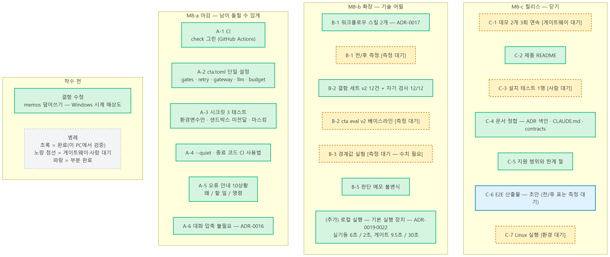
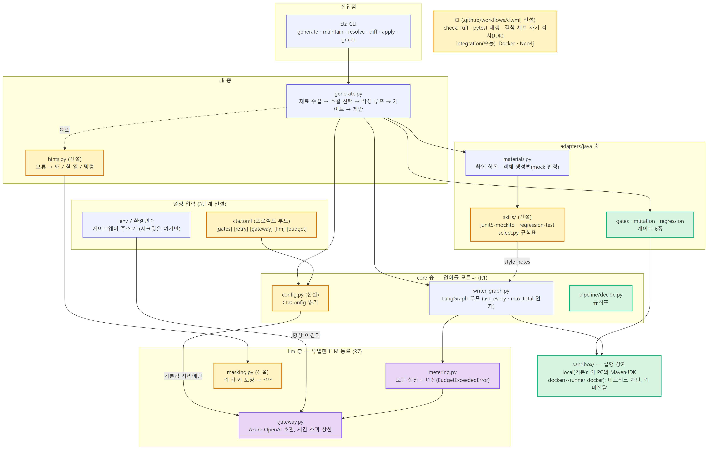
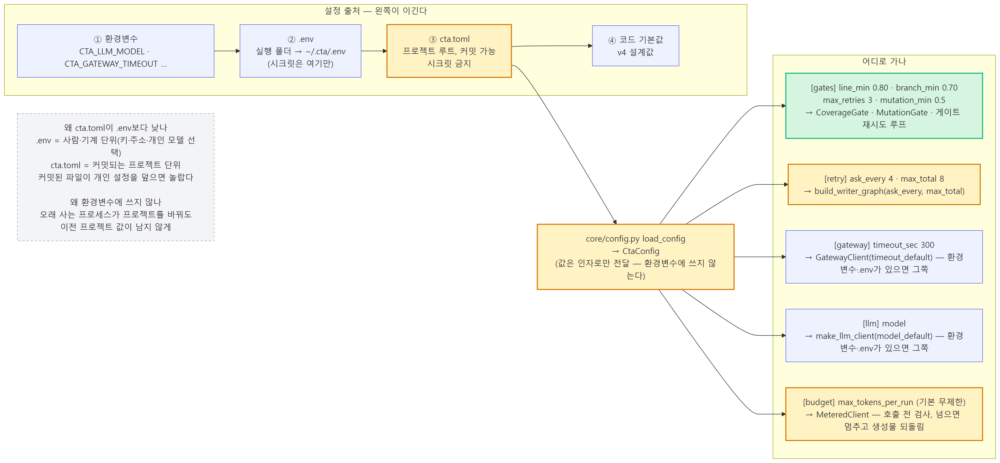
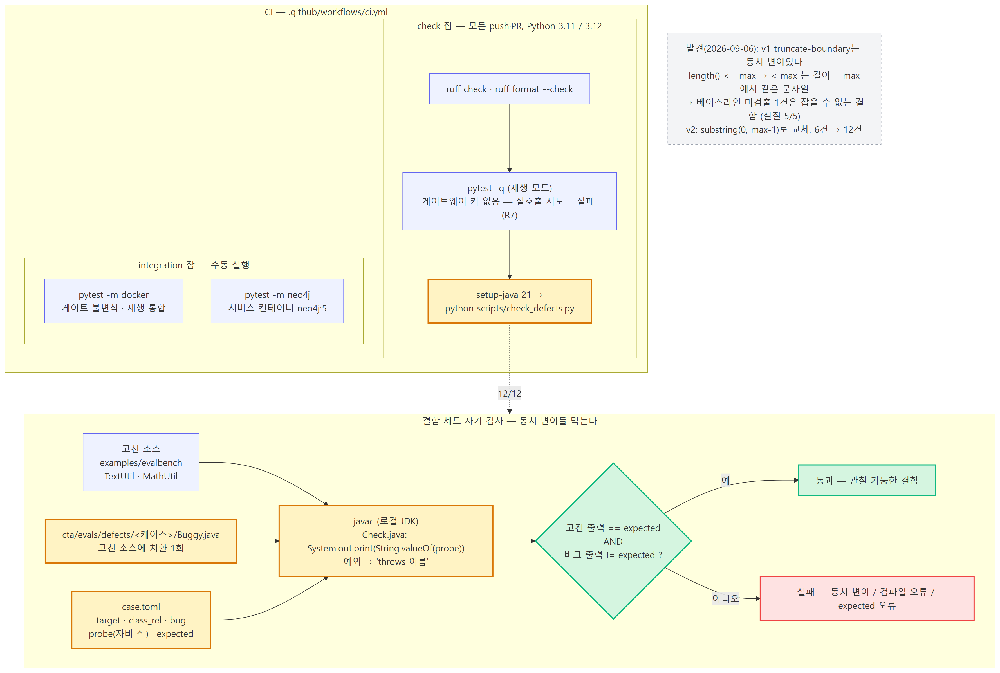
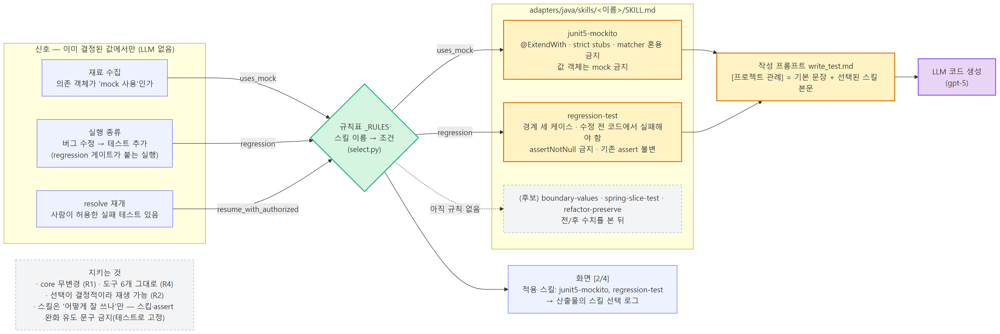
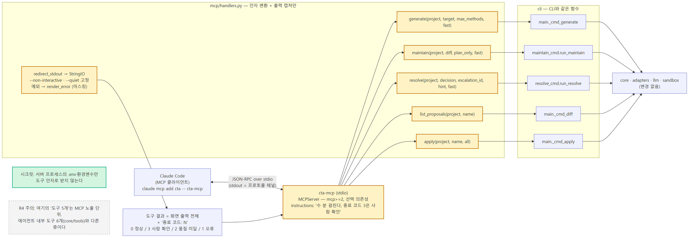

# Code Test Agent (`cta`) — E2E 서비스 개발 산출물

PoC(1단계)·테스트 및 고도화(2단계)에서 만든 에이전트를 **남이 설치해 돌릴 수 있는 물건**으로 닫는 단계다.
이 문서는 PoC구현.md와 같은 구성(한눈에 보기 → 계약 → 구현 → 문제 해결 → 검증 로그 원문 → 구현 범위 3구역)을 따른다.
2026-09-06 기준. Docker·게이트웨이가 있는 환경에서 채워야 하는 수치는 "**[측정 대기]**"로 표시했다.

## 한눈에 보기

- **이번 단계에서 구현한 것**: CI(재생 모드) · `cta.toml` 단일 설정(게이트·반복 상한·시간 초과·모델·토큰 예산) ·
  시크릿 3 테스트(환경변수만 / 샌드박스 미전달 / 출력 마스킹) · `--quiet` + 종료 코드 CI 사용법 · 오류 안내 "왜/할 일/명령" 9상황 ·
  **워크플로우 스킬**(규칙 선택, ADR-0017) · **MCP 서버**(도구 5개 = 명령 5개, ADR-0018) · 결함 세트 v2(12건) + 로컬 JDK 자기 검사 ·
  판단 메모 불변식 · 대화 압축 불필요 판정(ADR-0016) · **로컬 실행 모드 `--fast`**(Docker 없이 이 PC의 Maven·JDK, ADR-0019 — 실기동 6초) ·
  제품 README · 지원 범위와 한계 절
- **검증한 것**: 단위 테스트 222건(1단계 172 → +50), 결함 세트 자기 검사 12/12, MCP 도구 5개 in-process 등록·호출, CLI 오류 안내 스모크 2건,
  wheel에 스킬·프롬프트 데이터 포함
- **발견한 것**: (1) 판단 메모가 Windows 시계 해상도 때문에 덮어써지는 결함 (2) 2단계 벤치의 truncate-boundary가 **동치 변이**라
  어떤 테스트도 잡을 수 없었다 — 베이스라인 "5/6"의 미검출 1건은 잡을 수 없는 결함 (3) MCP SDK 2.x에서 FastMCP가 MCPServer로 바뀜
- **[측정 대기]**: 스킬 도입 전/후 수치, 결함 세트 v2 검출률, 데모 2개 3회 연속, Claude Code에서 MCP 실호출, Linux 실행, 설치 테스트 1명
- 구현 범위 3구역은 [§6](#6-구현-범위--동작-확인-완료--미검증--향후-확장), 계약 변경분은 [§2](#2-이번-단계의-계약-변경분)

| 항목 | 값 |
|---|---|
| 기간 | 2026-09-06 (1~3주차 작업을 하루에 진행) |
| 커밋 | 11개 (`b5c1232`…`6f63f91`), 전부 main에 push |
| 테스트 | 단위 222건 · Docker 통합 2건 · Neo4j 통합 1건 · 결함 세트 자기 검사 12건 |
| 새 모듈 | `core/config.py` · `llm/masking.py` · `cli/hints.py` · `adapters/java/skills/` · `mcp/` · `scripts/check_defects.py` |
| 새 ADR | 0016 대화 압축 불필요 · 0017 워크플로우 스킬 · 0018 MCP 서버 |

---

**작업 항목별 상태** — 초록 완료 / 노랑 점선 대기 / 파랑 부분



## 1. 목표와 판정

3단계 스킬의 목표는 "개발자(나 아닌 사람)가 설치 가이드만 보고 자기 프로젝트에 돌릴 수 있는 상태"다.
2단계 관문 3항목(게이트 불변식·베이스라인 수치·escalate→resolve 실연)은 통과 판정으로 진입했다(`docs/E2E/README.md` §1).
이 단계는 넓히지 않고 **닫는다** — 예외는 사람 멘토 피드백(기술 어필: 워크플로우에 스킬)이다.

## 2. 이번 단계의 계약 변경분

PoC구현.md §2.0의 계약에 더해진 것만 적는다. 전체는 `docs/contracts.md`.

| 계약 | 핵심 필드 | 만드는 곳 → 쓰는 곳 | 정의 파일 |
|---|---|---|---|
| `CtaConfig` | `gates: GateConfig` · `retry(ask_every=4, max_total=8)` · `gateway_timeout_sec` · `model` · `max_tokens_per_run` (None = 설정 안 함) | `cta.toml` → `run_generation`·`run_maintain`. 우선순위 환경변수 > .env > cta.toml > 기본값 | `core/config.py` |
| `Skill` / `SkillSignals` | `name, description, when, body` / `uses_mock, regression, resume_with_authorized` | 재료 수집·실행 종류 → 규칙표 `_RULES` → `PromptedGenerator.style_notes` | `adapters/java/skills/select.py` |
| MCP 도구 5개 | `generate(project, target, max_methods, fast)` · `maintain(project, diff, plan_only, fast)` · `resolve(project, decision, escalation_id, hint, fast)` · `list_proposals(project, name)` · `apply(project, name, all)` — 전부 `-> str`(화면 출력 + "종료 코드: N") | MCP 클라이언트 → cli 함수 그대로 | `mcp/handlers.py` |
| `Hint` | `why, todo, command` | 예외·오류 문구 → 화면 3줄 | `cli/hints.py` |
| 결함 케이스 | `target, class_rel, bug, probe, expected` + `Buggy.java` | `cta eval`(검출률) · `check_defects.py`(자기 검사) | `evals/defects/*/case.toml` |
| `MeteredClient(max_tokens)` | 누적 토큰이 상한에 닿으면 호출 전 `BudgetExceededError` | `run_generation` → 생성물 되돌림 + 안내 | `llm/metering.py` |

---

## 3. 핵심 구현 내용

**3단계 신설 모듈이 층 구조의 어디에 붙었나** — 주황 = 3단계 신설, 초록 = 일반 코드 안전장치, 보라 = LLM 경로



### 3.1 마감 — 남이 돌릴 수 있게 (M8-a)

**설정 우선순위와 행선지** — 환경변수 > .env > cta.toml > 코드 기본값



**CI 두 잡과 결함 세트 자기 검사**



- **CI** `.github/workflows/ci.yml`: `check`(Python 3.11/3.12 · ruff · `pytest -q` 재생 모드 · 결함 세트 자기 검사) 모든 push,
  `integration`(Docker · Neo4j 서비스 컨테이너) 수동. 게이트웨이 키 없이 돈다 — 실호출이 시도되면 실패해야 정상(R7)
- **설정 파일** `cta.toml` 절 5개. 시크릿은 받지 않는다. cta.toml 값은 환경변수의 기본값 자리에만 놓여 개인 설정(.env)을 덮지 않는다
- **시크릿**: `docker run` 인자 조립을 순수 함수로 분리해 `-e`류 옵션이 없음을 테스트로 고정(샌드박스 미전달). 출력 직전 마스킹.
  기록 파일에 키 없음. 키 없으면 클라이언트 생성 시점에 실패
- **오류 안내**: 예외·문구 → 표 9행 → "오류: 원인 / 왜 / 할 일 / 명령". 진입점 `main()`이 유일한 출구, `CTA_DEBUG=1`이면 전체 추적
- **CI 사용법**: 종료 코드 0/3/2/1의 뜻과 GitHub Actions 예시(3은 실패가 아니라 리뷰 요청). `--quiet`로 진행 줄 생략

### 3.2 확장 — 기술 어필 (M8-b)

**스킬 선택 흐름** — 신호(이미 결정된 값) → 규칙표 → SKILL.md → 프롬프트



**MCP 호출 경로** — Claude Code → cta-mcp → 핸들러(인자 변환·출력 캡처) → CLI와 같은 함수



- **워크플로우 스킬(ADR-0017)**: `adapters/java/skills/<이름>/SKILL.md` 2개(junit5-mockito · regression-test). 선택은 규칙표 —
  신호는 재료 수집의 mock 판정, 재발 방지 게이트가 붙는 실행, resolve 재개처럼 **이미 결정된 값**에서만 나온다(LLM 없음, 재생 가능).
  도구는 6개 그대로(R4), core 무변경(R1). 화면 `[2/4] 적용 스킬: …`이 선택 로그다. 스킬 본문에 스킵 유도 문구가 없음을 테스트로 고정
- **MCP 서버(ADR-0018)**: 도구 5개 = 명령 5개. 핸들러는 cli 함수를 Namespace로 **그대로** 호출하고 stdout을 캡처해 돌려준다 —
  로직 복제 0줄, stdio 프로토콜 채널 보호. SDK(`mcp>=2`)는 선택 의존성, 진입점 `cta-mcp`, 등록 `claude mcp add cta -- cta-mcp`
- **결함 세트 v2**: 6 → 12건(하한 누락·반복 경계·컬렉션 순서·예외 누락·대소문자·앞 공백 추가). `scripts/check_defects.py`가 로컬 JDK로
  버그 버전을 컴파일하고 probe를 고친 버전과 비교해 **동치 변이를 막는다**. CI에서도 돈다
- **판단 메모 불변식**: 규칙표를 무시하라는 적대적 메모를 넣어도 조치가 같고, `decide()`에 메모 인자가 없음을 테스트로 고정
- **대화 압축(ADR-0016)**: 구현하지 않는다 — 작성 루프는 매 시도 단발 프롬프트라 누적이 없다. 세 번째 시도의 프롬프트에 첫 실패가 없음을 테스트로 고정

### 3.2b 로컬 실행 모드 `--fast` (ADR-0019, 사용자 요청)

Docker 준비 단계(첫 실행 5분)와 실행마다 수십 초가 반복 개발에서 가장 큰 비용이었다. `--fast`가 이제 **Docker 대신 이 PC의
Maven·JDK로 실행**하고 커버리지·뮤테이션 게이트를 생략한다. `LocalSandbox`는 `DockerSandbox`와 같은 `run()` 시그니처
(`Sandbox` 프로토콜)라 어댑터는 바뀌지 않았다 — 컨테이너 경로를 호스트 경로로 번역하고 `-o`·`-Dmaven.repo.local=`을 뺀다.
R6(샌드박스 밖 실행 금지)은 "사용자가 명시한 경우에만" 예외를 두는 것으로 CLAUDE.md를 갱신했고, 코드가 스스로 로컬로 폴백하는
경로는 없다. 켜면 경고 한 줄이 나온다. 실기동(이 PC, Docker 없음): 기존 테스트 실행 **6초**, 컴파일 검사 **2초**, 빈 selector 거부(R5) 유지.

### 3.3 릴리스 (M8-c, 진행 중)

제품 README(5분 시작·명령 요약·문서 지도·한계), 개발 킷 내용은 `docs/개발환경.md`로 분리. 사용가이드 §13 CI · §14 MCP · §15 지원 범위와 한계.
ADR 색인(0001~0009 미반입 표기), CLAUDE.md 백엔드 표기 정정, PoC 산출물 길이 조정.

---

## 4. 주요 문제 해결 및 기술 리서치

| 이슈 구분 | 문제 상황 및 원인 | 리서치 및 해결 과정 |
|---|---|---|
| **결함** | 판단 메모 두 건을 연속 저장하면 한 건이 사라짐 — 파일명이 마이크로초 타임스탬프만이라 Windows 시계 해상도(~15ms) 안에서 같은 이름으로 덮어씀. 개발 환경에서는 재현되지 않아 2단계 내내 숨어 있었다 | • **발견:** 3.12 임시 환경에서 `pytest -q` 1건 실패 <br>• **적용:** 같은 자리 수 순번(`-00`, `-01`)을 붙여 이름을 구분하고 정렬 순서 유지. `datetime` 고정 회귀 테스트 |
| **벤치마크** | 2단계 베이스라인의 미검출 1건(truncate-boundary)이 "테스트가 못 잡은 것"으로 기록됐는데, 실제로는 `<=`→`<`가 길이==max에서 같은 결과를 내는 **동치 변이**라 어떤 테스트도 잡을 수 없었다 | • **리서치:** 뮤테이션 테스팅의 equivalent mutant 문제 <br>• **적용:** 케이스마다 `probe`/`expected`를 두고 로컬 JDK로 고친/버그 버전을 비교하는 자기 검사(`check_defects.py`). 관찰 가능한 결함(`substring(0, max-1)`)으로 교체. 베이스라인 해석은 실질 5/5 |
| **의존성** | MCP Python SDK 2.x에서 `FastMCP`가 `MCPServer`로 바뀌고 모듈 경로도 이동 — 학습 데이터 기준 코드는 import 시점에 깨진다 | • **리서치:** 설치본 `inspect`로 `tool`·`run`·`call_tool` 시그니처 확인, in-process 호출로 검증 <br>• **적용:** `mcp>=2` 선택 의존성, 핸들러는 SDK 없이 테스트, 서버 테스트는 `importorskip` |
| **설계** | 설정 우선순위 — 커밋되는 `cta.toml`이 개인 `.env`(모델·시간 초과)를 덮으면 놀랍다 | • **적용:** cta.toml 값은 `setdefault`로만 주입 → 환경변수 > .env > cta.toml > 기본값 |
| **규칙 검사** | R1 검사(`test_layering`)가 새 `core/config.py`의 **주석** "java·maven 문자열은 없다"를 위반으로 잡았다 | • **적용:** 주석 문구 수정. 검사가 주석까지 보는 것은 의도된 보수성이라 예외를 만들지 않았다 |
| **환경** | 이 PC의 콘솔(cp949)에서 한글 출력이 깨져 CLI 스모크가 조용히 실패한 것처럼 보였다 | • **적용:** `PYTHONUTF8=1`로 재실행. 사용가이드 문제 해결 표에 이미 있는 항목 |
| **재생** | 스킬이 프롬프트를 바꾸면 저장된 LLM 호출 기록 재생이 깨질 위험 | • **확인:** 골든 재생(`cta demo`)은 자체 `STYLE_NOTES`로 생성기를 만들어 영향 없음. 실호출 시나리오 기록 재생성은 측정 환경에서 |
| **검토(자체)** | 전체 diff 재검토에서 4건 발견 — ① cta.toml 값을 환경변수에 `setdefault`로 써넣어 오래 사는 MCP 서버가 다음 프로젝트를 다룰 때 이전 설정이 이김 ② MCP 핸들러의 전역 stdout 교체가 동시 호출에서 섞임 ③ Docker 미설치의 Windows 오류 원문에 'docker'가 없어 안내가 못 알아봄 ④ CI가 `[mcp]` 없이 설치해 MCP 서버 테스트가 항상 skip | • **적용:** ① 인자 전달(`GatewayClient(timeout_default)`)로 교체 + 테스트 ② `threading.Lock` 직렬화 ③ 샌드박스가 'docker'를 담아 다시 던짐 + 테스트 ④ `pip install -e ".[mcp]"`. 상세와 미조치 후보 6건은 `docs/E2E/e2e-notes.md` 4주차 |

---

## 5. 핵심 동작 검증

이 PC(Windows, Python 3.12 임시 환경, JDK 23, Docker·게이트웨이 없음)에서 실제로 돌린 것만 적는다.

| 검증 | 내용 | 결과 |
|---|---|---|
| 1 | `ruff check .` · `ruff format --check .` | 통과 · 152 files formatted |
| 2 | `pytest -q` (재생 모드) | **224 passed**, 4 deselected(docker·neo4j) — 검토 후 2건 추가 |
| 3 | `python scripts/check_defects.py` — 결함 12건 컴파일 + probe 비교 | **12/12 통과** |
| 4 | MCP SDK 2.x in-process — 도구 5개 등록, `call_tool("list_proposals")` 왕복 | 도구 이름 5개 일치, `is_error=False`, 본문 "대기 중인 제안 없음" |
| 5 | CLI 오류 안내 스모크 — pom.xml 없는 폴더 / 게이트웨이 키 비움 | 각각 "오류 + 왜/할 일/명령" 4줄, 종료 코드 1, 전체 추적 없음 |
| 6 | `uv build --wheel` — 데이터 파일 포함 | `skills/*/SKILL.md` 2개, `prompts/*.md` 4개 포함 |

**[검증 3 — 결함 세트 자기 검사]** 실행 로그 원문:

```text
$ python scripts/check_defects.py
통과  clamp-lowerbound           고친 '0' / 버그 '-5'
통과  clamp-wrongop              고친 '10' / 버그 '15'
통과  countwords-leading-space   고친 '2' / 버그 '3'
통과  fib-base                   고친 '0' / 버그 '1'
통과  fib-loop-offbyone          고친 '5' / 버그 '3'
통과  median-unsorted            고친 '2.0' / 버그 '1.0'
통과  palindrome-case            고친 'true' / 버그 'false'
통과  palindrome-empty           고친 'false' / 버그 'true'
통과  percent-exception-type     고친 'throws IllegalArgumentException' / 버그 '-1'
통과  rounding-negative          고친 '-4' / 버그 '-3'
통과  truncate-boundary          고친 'abcde' / 버그 'abcd'
통과  truncate-null              고친 '' / 버그 'throws NullPointerException'

12/12 통과
```

**[검증 5 — 오류 안내]** 실행 로그 원문 (pom.xml 없는 폴더에서):

```text
$ cta generate --class X --project <pom.xml 없는 폴더> --fast --non-interactive
오류: pom.xml이 없다: C:\...\scratchpad
  왜:    pom.xml이 없는 폴더다 — 단일 모듈 Maven 프로젝트만 지원한다
  할 일: 프로젝트 루트를 지정한다
  명령:  cta <명령> --project <pom.xml이 있는 폴더>
exit=1
```

```text
$ cta generate --class OrderService --project examples/demo --fast --non-interactive   (게이트웨이 키 비움)
오류: 환경변수 CTA_GATEWAY_URL·CTA_GATEWAY_API_KEY가 필요하다 — .env(gitignore) 또는 환경변수로만 설정한다(v4 6.6, ADR-0011)
  왜:    게이트웨이 주소·API 키가 설정에 없다
  할 일: .env를 실행 폴더 또는 ~/.cta/.env에 만들고 CTA_GATEWAY_URL, CTA_GATEWAY_API_KEY를 채운다 (.env는 커밋 금지)
  명령:  copy .env.example .env   (그다음 값 채우기)
exit=1
```

**[측정 대기 — Docker·게이트웨이 환경에서 채울 것]**

| 항목 | 방법 | 기록 위치 |
|---|---|---|
| 스킬 전/후 | SC-001(`--max-methods 4`)·SC-002·`cta eval` — 스킬 없음/있음 각 3회. 1차 통과율·시도 수·토큰·게이트 탈락·검출률 | `evals/results/`, 이 문서 §5 표 |
| 결함 세트 v2 베이스라인 | `cta eval` (12건) | `evals/results/eval-local-defects-v2-*.json` |
| 데모 2개 3회 연속 | `examples/demo/README.md` 절차 | `docs/E2E/데모실행기록.md` |
| MCP 실호출 | `claude mcp add cta -- cta-mcp` → `generate` 호출 캡처 | 이 문서 §5 |
| Linux 실행 · 설치 테스트 1명 | `pip install` → `cta demo` / 사용가이드만으로 `cta generate` | `docs/E2E/e2e-notes.md` |

---

## 6. 구현 범위 — 동작 확인 완료 / 미검증 / 향후 확장

**동작 확인 완료** (이 PC에서 실행 결과로 확인)

| 항목 | 근거 |
|---|---|
| `cta.toml` 설정 5절, 우선순위, 반복 상한 주입, 토큰 예산 | `tests/test_config.py`, `test_writer_graph.py::TestConfigurableLimits`, `test_secrets.py::TestTokenBudget` |
| 시크릿 3 테스트 | `test_llm_config.py`, `test_secrets.py` |
| 오류 안내 9상황 + `CTA_DEBUG` | `tests/test_hints.py`, CLI 스모크(검증 5) |
| 스킬 읽기·규칙 선택·렌더링·불변식 | `tests/test_skills.py`(10건) |
| MCP 핸들러 5개 + SDK 등록·호출 | `tests/test_mcp.py`(6건), 검증 4 |
| 결함 세트 12건이 컴파일되고 관찰 가능 | 검증 3 |
| 판단 메모 불변식, 프롬프트 비누적 | `test_maintain_core.py::TestMemosCannotBypassRules`, `test_writer_graph.py::TestPromptDoesNotAccumulate` |
| memos 덮어쓰기 결함 수정 | `test_escalation_flow.py::TestMemoFileNames` |
| 패키징(스킬·프롬프트 데이터, `cta-mcp` 진입점) | 검증 6, `pyproject.toml` |

**구현됐지만 미검증** (Docker·게이트웨이·GitHub 필요)

| 항목 | 남은 확인 |
|---|---|
| CI 워크플로우 | GitHub Actions 첫 실행 결과(push는 됨) |
| 스킬이 실제 프롬프트에 들어간 생성 | 실호출 1건 + 전/후 수치 |
| `--quiet`, 토큰 예산 초과 시 되돌림 | 실호출 |
| MCP `generate`·`maintain` 실호출 | Claude Code 등록 후 호출 |
| 결함 세트 v2 검출률 | `cta eval` |

**향후 확장 예정**

| 항목 | 왜 |
|---|---|
| 스킬 추가(`boundary-values`·`spring-slice-test`·`refactor-preserve`) | 전/후 수치를 본 뒤 |
| 판단 메모 임베딩 검색 | 게이트웨이 임베딩 API 확인 후. 불변식은 유지 |
| MCP 비동기 실행(시작/조회/결과) | 클라이언트가 수 분을 기다리지 못할 때 — ADR-0018 후속 |
| Defects4J·EvoSuite | 리눅스 환경 확보 시 하네스에 케이스만 교체(ADR-0014) |
| 멀티모듈 Maven·Gradle, CALLS 엣지, AST 파서 | 3단계 범위 밖 |

---

## 7. 문서 지도 · 재현 명령

| 문서 | 내용 |
|---|---|
| `docs/E2E/README.md` · `작업목록.md` · `릴리스체크리스트.md` · `e2e-notes.md` | 3단계 계획·항목별 상세·체크리스트·작업 기록 |
| `docs/adr/ADR-0016~0018` | 대화 압축 불필요 · 워크플로우 스킬 · MCP 서버 |
| `docs/사용가이드.md` §9·§13·§14·§15 | cta.toml · CI · MCP · 지원 범위와 한계 |
| `docs/피드백반영계획.md` | AI 멘토·사람 멘토 피드백 반영 계획과 진행 상태 |

```
pytest -q                              # 단위 222건 (Docker·Neo4j 제외)
python scripts/check_defects.py        # 결함 세트 자기 검사 (JDK 17+)
pip install -e ".[mcp]" && cta-mcp     # MCP 서버 (stdio) — Claude Code: claude mcp add cta -- cta-mcp
cta eval                               # 결함 세트 검출률 (Docker·게이트웨이 필요)
```
