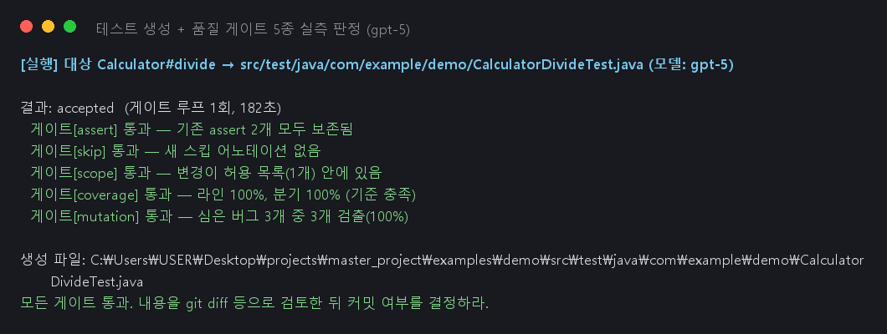

# Code Test Agent — 구현 산출물

개발자가 Java 코드를 고치면, 그 변경에 맞는 JUnit 테스트를 대신 만들어 주는 LLM
에이전트다. 핵심 설계는 한 문장으로 요약된다: **LLM이 등장하는 곳은 두 군데
(의도 분류, 테스트 작성)뿐이고, 안전을 지키는 부분은 전부 일반 코드다.**
전 과정이 사내 LLM 게이트웨이(gpt-5)와 인터넷 차단 Docker 실행 환경 위에서
실제로 동작하며, 아래 검증 절의 캡처는 모두 실행 결과 그대로다.

### 핵심 구현 내용

**1.1 에이전트 워크플로우 (Agent Workflow)**

* **구현 기능:** 다섯 단계 파이프라인 —
  `변경 추출(일반 코드) → 의도 분류(LLM 1회) → 조치 결정(규칙표) → 테스트 작성(LLM
  반복 루프) → 품질 게이트(일반 코드)`. 테스트 작성 안쪽은 LangGraph 그래프로,
  실행 도중 **사람 개입 지점 2곳**이 실제로 동작한다.

* **동작 원리:** git diff에서 바뀐 메서드를 뽑고, LLM이 "왜 바꿨나"(버그 수정/
  리팩터링/새 기능/불확실)를 분류한다. **할 일은 미리 적힌 규칙표가 정한다** —
  LLM 분석은 작업 지침서 내용만 채우고 길은 못 바꾼다. 지침서가 틀리면 품질이
  떨어질 뿐이지만 길이 틀리면 사고(예: 기대값 무단 수정)이기 때문이다. 규칙표에는
  "기대값을 자동으로 고친다"는 행이 아예 없고, "리팩터링인데 테스트 실패"는 무조건
  사람에게 넘어간다. 테스트 작성 루프는 실패 로그를 다음 프롬프트에 넣어 스스로
  고치되, 실패 성격을 기계적으로 분류해 — 환경 문제면 즉시 한계 보고, 같은 실패가
  반복되면 **그 자리에서 그래프를 정지**하고 터미널로 묻는다(계속/중지/힌트).
  답이 오면 같은 지점부터 재개된다.

* **주요 기술:** LangGraph(StateGraph, interrupt/checkpointer), gpt-5(사내 게이트웨이),
  포트/어댑터 구조(핵심 로직은 인터페이스만 알고 구현을 갈아 끼움 — 가짜 구현으로
  단위 테스트 103건이 외부 의존 없이 돈다).

**1.2 도구(Tool) 및 함수 연동**

* **구현 기능:** 에이전트 도구 6개(대상 조사·코드 그래프 조회·테스트 쓰기·테스트
  실행·품질 확인·한계 보고) + 인터넷 차단 Docker 실행 환경 + **품질 게이트 5종**.

* **동작 원리:** 실행 환경은 2단계다 — 준비(인터넷 연결: 의존성·분석 도구 캐시)
  / 실행(`--network none` + 캐시 읽기 전용, 지정한 테스트만). 게이트 5종은 전부
  LLM 없는 기계 검사로, 테스트를 만든 에이전트는 판정에 관여하지 못한다:
  ① 기존 assert **내용** 비교(assertEquals→assertNotNull 같은 완화 탈락)
  ② 스킵 어노테이션 금지(@Disabled, 전체 경로 우회 포함) ③ 소스 전체 해시 대조
  (허용 목록 밖 수정 탈락) ④ JaCoCo 실측 커버리지(대상 라인 80%·분기 70%,
  `cta.toml`로 조정, 탈락 사유에 미실행 라인·분기 명시) ⑤ PIT 뮤테이션(코드에
  기계적으로 심은 버그를 못 잡으면 탈락 — 원본 pom은 건드리지 않고 복제본 사용).
  탈락 사유는 문장으로 모델에게 반환돼 재시도(기본 3회)하고, 소진하면 자동 반영
  없이 "사람 확인 필요"로 남는다.

* **주요 기술:** Docker(`--network none`, 읽기 전용 마운트), Maven go-offline+예열,
  JaCoCo(XML 라인·분기 파싱), PIT(pitest-maven + junit5 플러그인, 메서드 단위 집계),
  Python Protocol, JUnit 5.

**1.3 데이터 및 컨텍스트 (RAG & Context)**

* **구현 기능:** ① **코드 그래프**(Neo4j) — 클래스·메서드 노드와 확정 관계 3종
  (선언한다 / 만든다 / **검증한다=커버리지 실측**), ② 모양이 닮은 기존 테스트를
  찾아 프롬프트에 참고 예시(few-shot)로 첨부, ③ 모든 LLM 호출의 녹화·재생.

* **동작 원리:** 코드 검색은 "의미가 비슷한 문서"가 아니라 "연결된 코드"가 정답을
  준다 — 코드를 읽거나 실측해서 100% 확정되는 관계만 그래프에 넣는다(추정이 필요한
  호출 관계는 후순위로 미룸). 특히 "이 메서드를 검증하는 테스트는?"은 테스트
  클래스별 JaCoCo 실행 기록에서 뽑은 **실측**이라, 파이프라인이 "기존 테스트가
  깨졌는가"를 판단하는 근거가 된다. 그래프 질의는 미리 정의된 6종만 허용(자유
  쿼리 금지)하고 답은 800토큰 상한. 그래프가 없는 프로젝트는 파싱 기반 대체
  구현으로 동작한다. 모든 LLM 호출은 한 계층을 지나며 요청·응답이 JSON 파일로
  저장되고, 자동 테스트는 그 기록을 재생한다(비용 0, 결과 항상 동일, 기록이 없으면
  실패 — 몰래 실호출 금지).

* **주요 기술:** Neo4j 5(별도 컨테이너 — 격리 경계 밖), JaCoCo 실측 기반 엣지,
  정규식+중괄호 짝 맞추기 Java 파싱, JSON 호출 기록, Azure OpenAI 호환 게이트웨이,
  `.env` 시크릿 분리(gitignore).

### 주요 문제 해결 및 기술 리서치

| **이슈 구분** | **문제 상황 및 원인** | **리서치 및 해결 과정 (Reference & Solution)** |
| --------- | ------------------------------------ | ----------------------------------------------------------------------------------------- |
| **도구 연동** | 비슷한 테스트 검색이 항상 0건 — 정규식의 느슨한 선두가 `@Test`의 "Test"를 반환 타입으로 잘못 읽어 테스트 메서드 인식 실패 | • **리서치:** Python `re`의 lookbehind 문법 • **적용:** 선두에 `(?<![@\w])` 추가 → 예시 2건 정상 수집. 정규식 파싱의 한계 사례로 기록 |
| **도구 연동** | 대상 프로젝트가 더 큰 git 저장소의 하위 폴더면 diff 경로가 어긋나 메서드 매핑이 전부 실패 | • **리서치:** git diff `--relative` 옵션 문서 • **적용:** `--relative` 추가 + 중첩 저장소 회귀 테스트 → 심볼 정확 매핑 (`Calculator` → `Calculator#add`) |
| **실행 환경** | 인터넷 차단 컨테이너에서 Maven 실행 실패 — `go-offline`이 일부 의존성을 빠뜨리는 알려진 한계. 커버리지·뮤테이션 도구는 아예 캐시에 없음 | • **리서치:** Maven 커뮤니티의 go-offline 미완전성 • **적용:** 준비 단계에서 실제 테스트 1회 "예열" + JaCoCo·PIT까지 함께 캐시 → 차단 상태에서 게이트 5종 전부 동작 |
| **품질 게이트** | PIT는 클래스 단위로 버그를 심어서, 대상 밖 메서드의 미커버 변형이 판정을 오염 — 정당한 테스트가 억울하게 탈락 | • **리서치:** PIT mutations.xml 스키마(mutatedMethod 필드) • **적용:** 대상 메서드의 변형만 집계하도록 필터 → 판정 정밀도 확보. pom을 못 건드리는 제약은 플러그인을 끼운 복제 pom으로 해결 |
| **보안/설정** | LLM 백엔드가 개발 중 확정되며 교체 + API 키가 커밋 대상 파일에 들어갈 뻔함 | • **리서치:** Azure OpenAI REST 문서(deployments 경로, `api-key` 헤더) • **적용:** 클라이언트 생성을 설정 모듈 한 곳으로, 주소·키는 `.env`(gitignore)로만, 커밋 전 diff에서 키 문자열 검사 → git 기록에 시크릿 0건 |
| **테스트 안정성** | 개발 PC의 로컬 `.env`가 단위 테스트 결과를 바꿈 / Windows 파이프의 보이지 않는 문자(BOM)가 사람 입력에 섞임 | • **리서치:** pytest 환경 격리 패턴, Windows 인코딩 동작 • **적용:** 설정 로더 경로 주입 + 입력 정규화 → 어느 환경에서든 동일 동작 |

### 핵심 동작 검증

**[검증 1: 테스트가 없는 메서드에 새 테스트 자동 생성 + 품질 게이트]**

* **입력:** 대상 `Calculator#divide` (0으로 나누면 예외를 던지는, 테스트 없는 메서드)
* **에이전트 동작:** ① 대상 조사 ② 모양이 닮은 기존 테스트 2건 수집 ③ gpt-5가
  테스트 생성 ④ 테스트 폴더 확인 후 저장·컴파일 ⑤ 인터넷 차단 실행 `Tests run: 2,
  Failures: 0` ⑥ 게이트 5종 판정(assert 보존·스킵 없음·범위 준수·커버리지·뮤테이션)
* **최종 결과:** 승인(accepted), 시도 1회, 182초 — 게이트 5종 전부 통과
  (커버리지 라인·분기 100%, 심은 버그 3개 중 3개 검출). 생성된 테스트는
  예외 타입뿐 아니라 메시지까지 검증했다.




**[검증 2: "동작이 바뀐 리팩터링"을 안전장치가 잡아 사람에게 넘김]**

가장 위험한 상황의 재현이다 — 개발자가 "동작 변화 없음"이라며 고쳤는데 실제로는
동작이 바뀐 경우. 잘못 설계된 에이전트라면 실패하는 테스트의 기대값을 고쳐
빨간불만 끄고 버그를 묻어버린다.

* **입력:** `add`의 구현을 바꾼 변경(실제로는 동작이 달라짐) + 메시지 "덧셈 구현
  정리 (동작 변화 없음)"
* **에이전트 동작:** ① 변경 추출 `Calculator#add` ② 의도: 리팩터링 ③ 그래프의
  **커버리지 실측**으로 이 메서드를 검증하는 기존 테스트(CalculatorTest)를 찾아
  실행 → **실패 감지** ④ 규칙표: "리팩터링인데 테스트 실패 → 사람에게 넘김"
  (기대값을 고치는 선택지는 표에 존재하지 않음) ⑤ 사람이 "진행"을 답하자 그 지점부터
  재개돼 테스트 생성 결정으로 전환
* **최종 결과:** 자동으로 아무것도 덮어쓰지 않았고, 사람의 결정 이후에만 진행됐다.


**[검증 3: 안전장치 불변식 — 악의적 시나리오가 전부 차단되는가]**

모델이 규칙을 어기는 상황을 일부러 만들어 게이트가 막는지 자동 테스트로 고정했다
(전부 통과 = 게이트가 사양대로 작동한다는 증거):

| 악의적 시나리오 | 결과 |
|---|---|
| 기존 assertEquals를 assertNotNull로 완화 | assert 게이트 탈락 ✅ |
| 기존 assert 삭제 / 테스트 파일 삭제 | assert 게이트 탈락 ✅ |
| @Disabled로 테스트 비활성화 (전체 경로 우회 포함) | 스킵 게이트 탈락 ✅ |
| 테스트를 통과시키려고 대상 코드를 수정 | 범위 게이트 탈락 ✅ |
| assert 없이 실행만 하는 테스트 (커버리지 100%) | 커버리지 게이트는 통과하지만 **뮤테이션 게이트에서 탈락** ✅ — "커버리지 단독으로는 빈 테스트를 못 거른다"는 설계 전제의 실측 증명 (Docker 실측, 28분 51초) |

**[검증 4: 결함 검출률 실측 — 심어 둔 버그를 생성 테스트가 잡는가]**

(고친 버전, 버그 버전) 쌍 6건의 결함 세트로 측정: 고친 버전에서 테스트를 생성하고
(게이트 포함, 사람 개입 없음) 버그 버전에 돌려 **실패하면 검출 성공**.
수치는 모델·프롬프트 해시·데이터셋 버전에 묶어 기록해 누구든 재현할 수 있다.

| 지표 (gpt-5, 게이트 5종 포함, local-defects-v1) | 결과 |
|---|---|
| 게이트 승인율 | **6/6 (100%)** — 전 케이스 게이트 5종 모두 통과, 재시도 0회 |
| **버그 검출률** | **5/6 (83.3%)** |
| 에스컬레이션율 | 0% |
| 평균 생성 시도 | 1.0회 (전부 첫 생성에 통과) |
| 소요 | 총 19.5분 (준비 포함), 케이스당 102~148초 |

검출된 버그 유형: 잘못된 연산자, 기저 조건 오류, 빈 문자열 처리, 음수 반올림,
null 방어 누락. **미검출 1건은 경계 off-by-one**(길이가 정확히 max인 경우) —
생성 테스트가 경계값 자체를 시험하지 않았다. 이 사례가 다음 개선(경계값 강조
프롬프트)의 기준선이 된다: 개선 후 같은 세트를 다시 돌려 수치로 비교한다.


* **재현 방법:**

```
pytest -m docker -o addopts=""                   # 통합·불변식 실측 (Docker)
.venv/Scripts/python scripts/demo_golden.py      # 검증 1 재생 (LLM 비용 0)
.venv/Scripts/python scripts/run_eval.py         # 검증 4 하네스 (결과: evals/results/)
```
