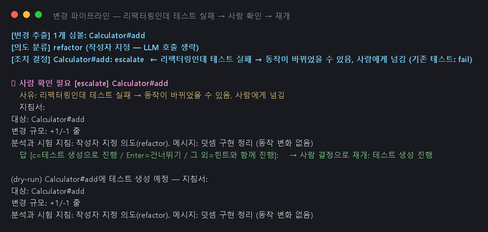
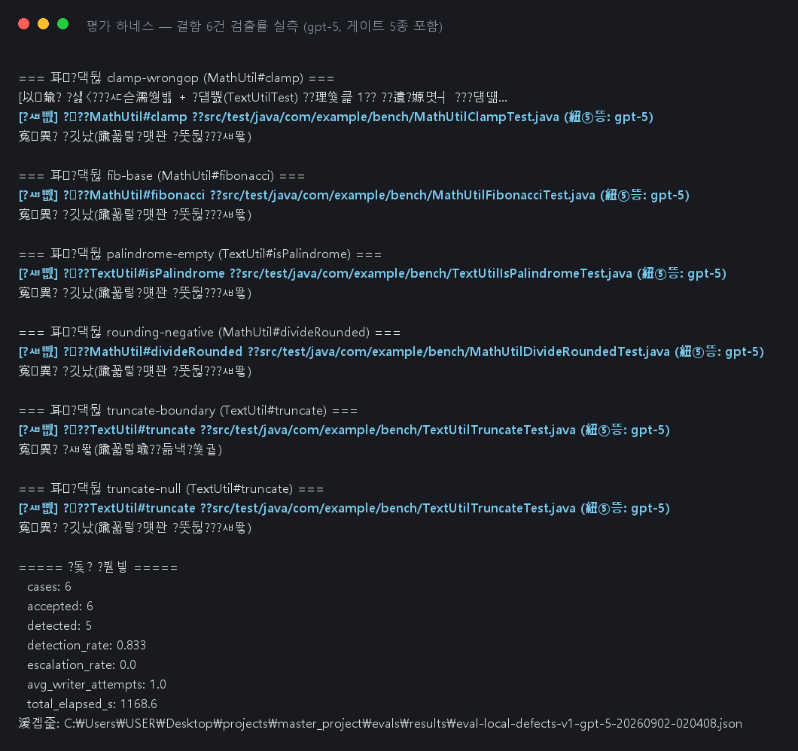

# Code Test Agent — 구현 산출물

**한 줄 요약**: Java 코드 변경에 맞는 JUnit 테스트를 자동 생성·유지보수하는 CLI 도구(`cta`).
LLM은 두 곳(의도 분류·테스트 작성)에만 쓰고, 안전장치는 전부 일반 코드다.

**사용 흐름**: `cta generate 파일명.java` 또는 `cta run`(생성) → `cta diff`(검토) → `cta apply`(반영).
파일 이름 하나면 파일 탐색·프로젝트 인식·테스트 없는 메서드 선별까지 자동이다.
생성물은 제안으로 보관되며, 소스 반영은 항상 사람의 명령으로만 일어난다.

### 핵심 구현 내용

**1.1 에이전트 워크플로우**

* **구현 기능**: 5단계 파이프라인 + 사람 개입 지점 2곳
  ```
  변경 추출(git diff) → 의도 분류(LLM 1회) → 조치 결정(규칙표) → 테스트 작성(LLM 루프) → 품질 게이트
       일반 코드            🤖                  일반 코드              🤖                    일반 코드
  ```
* **동작 원리**
  - 조치 결정은 규칙표 조회 — LLM 분석은 지침서 내용만 채우고 **길은 못 바꾼다**.
    "기대값 자동 수정" 행은 표에 없음. 리팩터링+테스트 실패 = 무조건 사람에게
  - 작성 루프는 실패 로그를 다음 프롬프트에 넣어 자기 수정. 실패를 기계 분류해
    환경 문제→즉시 보고, 동일 실패 반복→**그 자리에서 정지 후 사용자 질문**(계속/중지/힌트),
    답을 받으면 같은 지점부터 재개
  - 상한 이중화: 3회마다 질문, 하드 캡 6회 → 한계 보고(정상 종료)
* **주요 기술**: LangGraph(StateGraph·interrupt·checkpointer), gpt-5(사내 게이트웨이),
  포트/어댑터 구조(Fake 교체로 단위 테스트 109건이 외부 의존 없이 실행)

**1.2 도구(Tool) 및 함수 연동**

* **구현 기능**: 에이전트 도구 6종 + 인터넷 차단 실행 환경 + 게이트 5종 + 제안 저장소
* **동작 원리**
  - 실행 환경 2단계: 준비(온라인, 의존성·분석 도구 캐시) / 실행(`--network none`,
    캐시 읽기 전용, **지정한 테스트만**)
  - 도구는 예외 대신 "모델이 읽을 문장" 반환(상한 4,000자)
  - 게이트 5종(전부 기계 검사, 에이전트는 판정 관여 불가):

  | 게이트 | 검사 방법 | 잡는 것 |
  |---|---|---|
  | assert | 호출문 내용 비교 | 기존 검증 삭제·완화 (assertEquals→assertNotNull) |
  | skip | 어노테이션 카운트 | @Disabled 부착 (전체 경로 우회 포함) |
  | scope | 소스 전체 해시 대조 | 허용 목록 밖 수정 (대상 코드 조작) |
  | coverage | JaCoCo 실측 | 대상 라인 80%·분기 70% 미달 (cta.toml 조정) |
  | mutation | PIT (복제 pom) | 심은 버그를 못 잡는 빈 테스트 |

  - 탈락 사유는 모델에 반환→재시도(3회)→소진 시 "사람 확인" 제안으로 보관
* **주요 기술**: Docker, Maven go-offline+예열, JaCoCo, PIT(+junit5 플러그인, 메서드 단위 집계)

**1.3 데이터 및 컨텍스트**

* **구현 기능**: Neo4j 코드 그래프 + few-shot 예시 검색 + LLM 호출 녹화·재생
* **동작 원리**
  - 그래프에는 **확정 관계만**: 선언한다 / 만든다(정적 파싱) / 검증한다(**JaCoCo 실측**).
    "이 메서드를 검증하는 테스트는?"이 실측 기반이라, 파이프라인의 "기존 테스트가
    깨졌는가" 판단 근거가 된다. 질의는 사전 정의 6종만, 답 800토큰 상한
  - few-shot: 기존 테스트 중 대상과 모양(파라미터 수·예외 유무)이 닮은 2건을 프롬프트에 첨부
  - 녹화·재생: 모든 LLM 호출은 한 계층 경유, 요청·응답을 JSON으로 저장 → 자동
    테스트는 재생(비용 0, 결정적). 기록 없으면 실패 — 몰래 실호출 금지
* **주요 기술**: Neo4j 5(격리 경계 밖 별도 컨테이너), Azure OpenAI 호환 게이트웨이,
  `.env` 시크릿 분리

### 주요 문제 해결 및 기술 리서치

| 이슈 구분 | 문제 상황 및 원인 | 리서치 및 해결 |
|---|---|---|
| 도구 연동 | 유사 테스트 검색 0건 — 정규식이 `@Test`의 "Test"를 반환 타입으로 오인 | Python re lookbehind 문서 → 선두 `(?<![@\w])` 추가로 해결 |
| 도구 연동 | 상위 git 저장소의 하위 폴더 프로젝트에서 diff 경로 어긋남 → 메서드 매핑 전멸 | git diff `--relative` 문서 → 옵션 추가 + 회귀 테스트 |
| 실행 환경 | 차단 컨테이너에서 Maven 실패 — go-offline이 의존성 일부 누락, 분석 도구는 캐시에 없음 | Maven 커뮤니티 알려진 한계 → 준비 단계에 실제 실행 1회 예열 + JaCoCo·PIT 캐시 포함 |
| 품질 게이트 | PIT가 클래스 단위로 버그를 심어 대상 밖 메서드가 판정 오염 | mutations.xml 스키마(mutatedMethod) → 대상 메서드만 집계. 원본 pom 보호는 복제 pom으로 |
| 보안/설정 | API 키가 커밋 파일에 들어갈 뻔 + 백엔드 스펙 변경 대응 | Azure OpenAI REST 문서 → 클라이언트 생성 단일화, 키·주소는 `.env`만, 커밋 전 diff 검사 → git 기록에 시크릿 0건 |
| 테스트 안정성 | 로컬 `.env`가 단위 테스트를 오염 / Windows 파이프 BOM이 입력에 섞임 | pytest 격리 패턴 → 설정 경로 주입 + 입력 정규화 |

### 핵심 동작 검증

**검증 1 — CLI 워크플로: 생성 → 검토 → 반영** (실행 122초)

`cta generate` 한 번으로: 대상 조사 → 유사 테스트 수집 → gpt-5 생성 → 차단 환경
실행 → **게이트 5종 전부 통과**(커버리지 100%/100%, 심은 버그 3/3 검출) → 제안 보관.
`cta diff`로 판정 요약 확인 후 `cta apply`로 반영:


생성된 테스트 (예외 타입뿐 아니라 메시지까지 검증):


**검증 2 — 위험 상황: "동작이 바뀐 리팩터링"을 차단** 

"동작 변화 없음"이라던 변경이 실제로는 동작을 바꾼 경우 — 잘못 만든 에이전트는
실패하는 테스트의 기대값을 고쳐 버그를 묻는다. 본 시스템의 실측 결과:

1. 커버리지 실측으로 기존 테스트를 찾아 실행 → **실패 감지**
2. 규칙표: 사람에게 넘김 (기대값 수정 선택지는 존재하지 않음)
3. 사람이 답해야만 재개



**검증 3 — 안전장치 불변식** (악의적 시나리오 자동 테스트, 전부 차단 확인)

| 악의적 시나리오 | 결과 |
|---|---|
| assertEquals→assertNotNull 완화 / assert·파일 삭제 | assert 게이트 탈락 ✅ |
| @Disabled 부착 (전체 경로 우회 포함) | skip 게이트 탈락 ✅ |
| 통과를 위해 대상 코드 수정 | scope 게이트 탈락 ✅ |
| assert 없는 커버리지 100% 테스트 | coverage는 통과하나 **mutation에서 탈락** ✅ (실측 28분 51초 — "커버리지 단독으론 빈 테스트를 못 거른다"의 증명) |

**검증 4 — 결함 검출률 실측** (gpt-5 · 게이트 5종 · 결함 세트 v1 6건)

방법: 고친 버전에서 테스트 생성(무인) → 버그 버전에 실행 → 실패하면 검출 성공.
수치는 모델·프롬프트 해시·데이터셋 버전에 묶어 기록(재현 가능).

| 지표 | 결과 |
|---|---|
| 게이트 승인율 | 6/6 (100%) — 전 케이스 첫 시도 통과 |
| **버그 검출률** | **5/6 (83.3%)** |
| 에스컬레이션율 | 0% |
| 소요 | 총 19.5분 (케이스당 102~148초) |

검출: 연산자 오류·기저 조건·빈 문자열·음수 반올림·null 누락. **미검출 1건 =
경계 off-by-one** → 다음 개선(경계값 강조 프롬프트)의 비교 기준선으로 기록.



**재현 명령**

```
cta demo                    # 검증 1 재생 (LLM 비용 0)
cta eval                    # 검증 4 하네스 (기록: evals/results/)
pytest -m docker -o addopts=""   # 검증 3 실측 불변식 포함 통합 테스트
```
