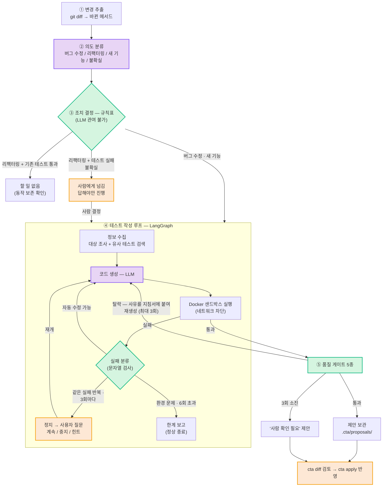
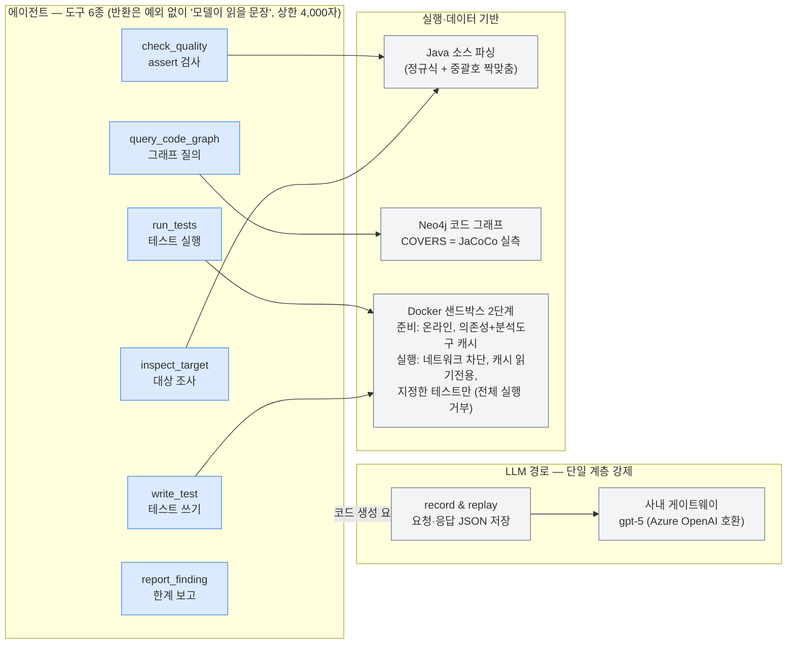

# Code Test Agent — 구현 산출물

**한 줄 요약**: Java 코드 변경에 맞는 JUnit 테스트를 자동 생성·유지보수하는 CLI 도구(`cta`).
LLM은 두 곳(의도 분류·테스트 작성)에만 쓰고, 안전장치는 전부 일반 코드다.

**사용 흐름** — 프로젝트 폴더에서 인자 없이 세 줄이면 된다:

```powershell
cta generate OrderService.java   # 파일 탐색·프로젝트 인식·테스트 없는 메서드 선별까지 자동
cta diff                         # 생성 결과 검토 (게이트 판정 + 코드 diff)
cta apply                        # 소스 반영 — 코드 변경은 항상 사람의 명령으로만
```

### 핵심 구현 내용

**1.1 에이전트 워크플로우**

* **구현 기능**: 5단계 파이프라인 + 사람 개입 지점 2곳 + 진행 상황 실시간 출력



보라 = LLM 호출(2곳뿐) / 초록 = 결정적 안전장치(LLM 관여 불가) / 주황 = 사람 개입

* **동작 원리**
  - 조치 결정은 규칙표 조회 — LLM 분석은 지침서 내용만 채우고 **길은 못 바꾼다**.
    "기대값 자동 수정" 행은 표에 없음. 리팩터링+테스트 실패 = 무조건 사람에게
  - 작성 루프는 실패 로그를 다음 프롬프트에 넣어 자기 수정. 정지 지점에서 사용자
    답(힌트)을 받으면 **같은 지점부터 재개** (LangGraph interrupt + checkpointer)
  - 모든 단계가 경과 시간과 함께 실시간 출력된다 — 어디서 오래 걸리는지 보인다
* **주요 기술**: LangGraph(StateGraph·interrupt·checkpointer), gpt-5(사내 게이트웨이),
  포트/어댑터 구조(Fake 교체로 단위 테스트 128건이 LLM·Docker 없이 실행)

**1.2 도구(Tool) 및 함수 연동**

* **구현 기능**: 에이전트 도구 6종 + 인터넷 차단 실행 환경 + 게이트 5종 + 제안 저장소



* **동작 원리** — 게이트 5종(전부 기계 검사, 테스트를 만든 에이전트는 판정 관여 불가):

  | 게이트 | 검사 방법 | 잡는 것 |
  |---|---|---|
  | assert | 호출문 내용 비교 | 기존 검증 삭제·완화 (assertEquals→assertNotNull) |
  | skip | 어노테이션 카운트 | @Disabled 부착 (전체 경로 우회 포함) |
  | scope | 소스 전체 해시 대조 | 허용 목록 밖 수정 (대상 코드 조작) |
  | coverage | JaCoCo 실측 | 대상 라인 80%·분기 70% 미달 (cta.toml 조정) |
  | mutation | PIT (복제 pom) | 심은 버그를 못 잡는 빈 테스트 |

  탈락 사유는 문장으로 모델에 반환→재생성(최대 3회)→소진 시 "사람 확인" 제안으로 보관
* **주요 기술**: Docker, Maven go-offline+예열, JaCoCo, PIT(+junit5 플러그인, 메서드 단위 집계)

**1.3 데이터 및 컨텍스트**

* **구현 기능**: Neo4j 코드 그래프 + few-shot 예시 검색 + LLM 호출 녹화·재생
* **동작 원리**
  - 그래프에는 **확정 관계만**: 선언한다 / 만든다(정적 파싱) / 검증한다(**JaCoCo 실측**).
    "이 메서드를 검증하는 테스트는?"이 실측 기반이라, 파이프라인의 "기존 테스트가
    깨졌는가" 판단 근거가 된다. 질의는 사전 정의 6종만, 답 800토큰 상한
  - few-shot: 기존 테스트 중 대상과 모양(파라미터 수·예외 유무)이 닮은 2건을 프롬프트에 첨부
  - 녹화·재생: 모든 LLM 호출은 한 계층 경유, 요청·응답을 JSON으로 저장 → 자동
    테스트는 재생(비용 0, 결정적). 기록 없으면 실패 — 몰래 실호출 금지
* **주요 기술**: Neo4j 5(격리 경계 밖 별도 컨테이너), Azure OpenAI 호환 게이트웨이,
  `.env` 시크릿 분리

### 주요 문제 해결 및 기술 리서치

에이전트 기능·성능·편의성에 직접 연관된 항목만 기록한다.

| 구분 | 문제 상황 및 원인 | 리서치 및 해결 → 전후 변화 |
|---|---|---|
| 기능 | 유사 테스트 검색이 항상 0건 — 정규식이 `@Test`의 "Test"를 반환 타입으로 오인 | Python re lookbehind 문서 → 선두 `(?<![@\w])` 추가. few-shot 예시 2건 정상 수집 |
| 기능 | 파일 단위 생성에서 유령 메서드 `if` 등장 — 정규식이 제어문 `if (x == 0) {`를 메서드로 오인 | Java 언어 명세(키워드는 식별자 불가) → 키워드 필터 + 회귀 테스트. 계획 3건(오탐 포함)→2건(정확) |
| 기능 | 대상 프로젝트가 상위 git 저장소의 하위 폴더면 diff 경로가 어긋나 메서드 매핑 전멸 | git diff `--relative` 문서 → 옵션 추가 + 회귀 테스트. `Calculator`(뭉개짐)→`Calculator#add`(정확) |
| 기능 | PIT가 클래스 단위로 버그를 심어 대상 밖 메서드가 mutation 판정 오염 | mutations.xml 스키마(mutatedMethod) → 대상 메서드만 집계. 원본 pom 보호는 복제 pom으로 |
| 성능 | 차단 컨테이너에서 Maven 실패 — go-offline이 의존성 일부 누락, 분석 도구는 캐시에 없음 | Maven 커뮤니티 알려진 한계 → 준비 단계에 실제 실행 1회 예열 + JaCoCo·PIT 캐시 포함. 이후 실행은 완전 오프라인 |
| 편의성 | 필수 인자가 많아(--project·--target 등) 사용성 저하 | 유사 도구 비교: Diffblue Cover CLI(무인자 실행, 지정은 좁힐 때만) vs Qodo Cover-Agent(전 경로 필수 인자) → Diffblue 관례 채택. 파일 이름 하나로 실행, 프로젝트 자동 인식, 제안 1건이면 이름 생략 |
| 편의성 | 생성 중 수십 초~수 분 무음 — 멈춘 것인지 진행 중인지 알 수 없음 | 진행 콜백을 포트로 추가(층 분리 유지) → LLM 호출·샌드박스 실행·게이트별 검사가 경과 시간과 함께 실시간 출력. 시간이 어디에 쓰이는지(LLM, coverage·mutation 실행) 즉시 보임 |

### 핵심 동작 검증 — `cta generate`

**검증 1 — 파일 이름 하나로 생성** (실측, --fast 47초)

`cta generate Calculator.java` 한 줄 실행 결과: 파일 탐색 → 프로젝트 자동 인식 →
메서드 선별(기존 테스트가 다루는 것은 건너뜀) → 없는 것만 생성:

```
파일: src\main\java\com\example\demo\Calculator.java  (프로젝트: demo)
  Calculator#add: 건너뜀 — 기존 테스트가 이미 참조 (강제 생성: --all)
  Calculator#divide: 생성 예정

──── Calculator#divide ────
[실행] 대상 Calculator#divide → src/test/java/com/example/demo/CalculatorDivideTest.java (모델: gpt-5)
→ accepted (47초)  게이트 assert:OK / skip:OK / scope:OK

===== 요약: 1개 중 제안 1건 =====
검토: cta diff
반영: cta apply  (여러 건이면 이름 지정 또는 --all)
```

**검증 2 — 게이트 5종 전체 통과 → 검토 → 반영** (실측 122초)

전체 게이트 모드: gpt-5 생성 → 차단 환경 실행 → **게이트 5종 전부 통과**
(커버리지 100%/100%, 심은 버그 3/3 검출) → 제안 보관 → `cta diff` 판정 확인 →
`cta apply` 반영:


생성된 테스트 — 정상 경로·경계·예외를 나눠 검증하고, 예외는 타입뿐 아니라
메시지까지 확인한다:


**진행 상황 출력** — 생성 중 각 단계가 경과 시간과 함께 실시간 출력된다
(수치는 실행마다 다름):

```
  [   0초] 정보 수집 — 대상 조사·비슷한 테스트 검색
  [   0초] 코드 생성 중 — LLM 호출 (1번째 시도, 수십 초 걸릴 수 있다)
  [   N초] 생성 완료 (n자, n초) → 파일 쓰기
  [   N초] 샌드박스 실행 중 — CalculatorDivideTest
  [   N초] 실행 끝 (n초) — 통과
  [   N초] 테스트 통과 — 품질 게이트 검사 시작
  [   N초] 게이트[assert] 검사 중 ... 통과
```

**재현 명령**

```
cta demo    # 검증 시나리오를 저장된 LLM 호출 기록으로 재생 (비용 0, 예제 원본 상태 필요)
pytest -q   # 단위 128건 — 작성 루프·게이트·파일 탐색 전부 Fake로 검증
```
