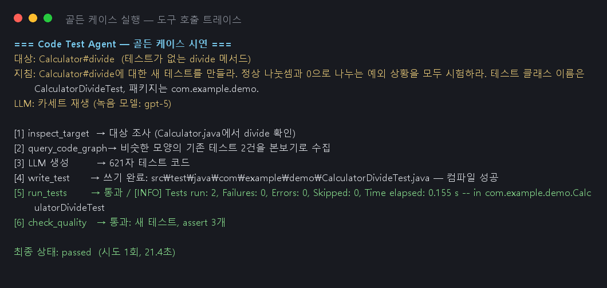

# Code Test Agent — PoC 구현 산출물

Java 코드가 바뀌면 그에 맞는 테스트 코드를 대신 만들어 주는 LLM 에이전트의 1단계(PoC) 결과물이다.
PoC의 목표는 하나였다: **클래스 1개에 대해 "테스트 생성 → 격리된 샌드박스 실행 → 통과"가
끝에서 끝까지 실제로 도는 것.** 이 목표는 사내 LLM 게이트웨이의 gpt-5 실호출로 달성했다
(아래 3. 핵심 동작 검증의 캡처 참조).

### 핵심 구현 내용

이번 PoC 단계에서 실제 코드로 구현된 핵심 기능들을 **동작 원리**와 **사용 기술** 중심으로 기술한다.

**1.1 에이전트 워크플로우 (Agent Workflow)**

* **구현 기능:** 테스트 작성 에이전트의 반복 루프 —
  `정보 수집 → 테스트 생성 → 샌드박스 실행 → 분기(통과/재시도/사용자 질문/한계 보고)`를
  LangGraph 그래프 하나로 구성했다.

* **동작 원리:** 그래프 상태(state)에 시도 횟수와 직전 실행의 실패 로그를 들고 다닌다.
  테스트가 실패하면 그 실패 로그가 다음 프롬프트에 그대로 들어가 모델이 스스로 고친다(자기 수정 루프).
  안전장치로 상한이 두 겹이다 — 3회 실패마다 "계속할까?"를 묻는 멈춤 지점(PoC에서는 자동 '계속'
  스텁, 실제 사용자 연결은 2단계), 6회에 도달하면 **"통과 못 시킨 이유"를 정리해 제출하고 정상
  종료**한다. "못 하겠다"가 실패가 아니라 정상 출구라서 조용한 무한 루프가 없다.

* **주요 기술:** LangGraph(StateGraph, conditional edges), gpt-5(사내 게이트웨이),
  포트/어댑터 패턴 — 그래프는 인터페이스(포트)만 알고, LLM·Docker를 Fake로 갈아끼워
  단위 테스트 54건이 외부 의존 없이 돈다.

**1.2 도구(Tool) 및 함수 연동**

* **구현 기능:** 에이전트에게 주는 도구 정확히 6개
  (대상 조사 `inspect_target` · 코드 그래프 조회 `query_code_graph` · 테스트 쓰기 `write_test` ·
  테스트 실행 `run_tests` · 품질 확인 `check_quality` · 한계 보고 `report_finding`)와,
  테스트를 실제로 돌리는 **인터넷 차단 Docker 샌드박스**.

* **동작 원리:** 샌드박스는 2단계로 나뉜다. 준비 단계(인터넷 연결)에서 Maven 의존성을 미리
  내려받아 캐시를 만들고, 실행 단계는 `--network none` + 캐시 읽기 전용 마운트로
  **지정한 테스트만**(`mvn -o test -Dtest=...`) 돌린다 — LLM이 만든 코드가 바깥세상에 닿을 수 없다.
  도구는 오류가 나도 예외를 던지지 않고 "그 경로에 파일 없음, 알려진 대상: …"처럼
  **모델이 읽고 다음 행동을 정할 수 있는 문장**을 반환한다(길이 상한 4,000자).
  안전 규칙은 전부 LLM 없는 일반 코드다: 빈 selector(=전체 테스트 실행) 거부,
  테스트 폴더 밖 쓰기 거부, 기존 테스트의 assert 개수가 줄면 탈락.

* **주요 기술:** Docker(`--network none`, 읽기 전용 마운트), `mvn dependency:go-offline` + 예열 실행,
  Python Protocol(포트 정의), JUnit 5 · maven-surefire.

**1.3 데이터 및 컨텍스트 (RAG & Context)**

* **구현 기능:** ① 프롬프트에 넣을 few-shot 예시로 "**비슷한 모양의 기존 테스트**"를 찾아 첨부,
  ② 모든 LLM 호출의 **record & replay**(카세트).

* **동작 원리:** ① 프로젝트의 기존 `@Test` 메서드를 파싱해, 대상 메서드와 모양
  (파라미터 개수, 예외 사용 여부)이 닮은 상위 2개를 골라 프롬프트에 본보기로 넣는다.
  좋은 본보기의 조건은 "내용이 비슷"이 아니라 "모양이 비슷"이다 — 예외를 던지는 메서드에는
  예외를 다루는 테스트 예시가 유용하다. (2단계에서 Neo4j 코드 그래프 쿼리로 교체될 자리다.)
  ② 모든 LLM 호출은 `llm/` 계층 한 곳을 지나며 요청·응답이 JSON 카세트 파일로 저장된다.
  자동 테스트는 카세트를 **재생**해서 돈다 — 결과가 매번 같고 LLM 비용이 0이다.
  재생 모드에서 카세트가 없으면 실패 처리한다(몰래 실호출로 폴백하지 않음).

* **주요 기술:** 정규식 + 중괄호 대응 기반 Java 파싱, JSON 카세트,
  Azure OpenAI 호환 게이트웨이(`/openai/deployments/{모델}/chat/completions`, `api-key` 헤더),
  `.env` 기반 시크릿 분리(gitignore).

### 주요 문제 해결 및 기술 리서치

| **이슈 구분** | **문제 상황 및 원인** | **리서치 및 해결 과정 (Reference & Solution)** |
| --------- | ------------------------------------ | ----------------------------------------------------------------------------------------- |
| **도구 연동** | few-shot 검색이 항상 0건 — 메서드 추출 정규식의 느슨한 선두가 `@Test`의 "Test"를 반환 타입으로 삼켜, 테스트 메서드 인식(is_test)이 전부 실패 | • **리서치:** Python `re` 모듈의 부정 lookbehind 문법 확인 • **적용:** 정규식 선두에 `(?<![@\w])`를 붙여 단어·`@` 중간에서 매칭이 시작되지 못하게 차단 → 본보기 2건 정상 수집. "정규식 파싱의 한계" 사례로 기록, 2단계에서 전용 파서 검토 |
| **샌드박스** | 인터넷 차단 컨테이너에서 Maven 실행 실패 — `dependency:go-offline`이 일부 의존성(surefire 실행기 등)을 빠뜨리는 알려진 한계 | • **리서치:** Maven 커뮤니티의 go-offline 미완전성 이슈(설계 문서 v4 6.3에도 명시) • **적용:** 준비 단계에서 실제 테스트를 1회 "예열" 실행해 빠진 의존성까지 캐시 완성 → 차단 상태 실행이 안정적으로 통과 |
| **보안/설정** | LLM 백엔드가 개발 중 두 번 바뀜(게이트웨이 스펙 미확정 → Claude → 사내 게이트웨이 확정) + API 키가 커밋 대상 파일에 들어갈 뻔함 | • **리서치:** Azure OpenAI REST 문서(deployments 경로, api-version, `api-key` 헤더) • **적용:** 클라이언트 생성을 `llm/config.py` 한 곳으로 모으고(백엔드 교체 시 이 파일만 수정), 주소·키는 `.env`(gitignore)로만 전달. 커밋 전 diff에서 키 문자열 자동 검사 → git 히스토리에 시크릿 0건 |
| **테스트 안정성** | 개발자 PC의 로컬 `.env`(모델 설정)가 단위 테스트 결과를 바꿔 어제는 통과하던 테스트가 실패 | • **리서치:** pytest의 monkeypatch·tmp_path를 이용한 환경 격리 패턴 • **적용:** 설정 로더에 `.env` 경로를 주입 가능하게 바꿔 테스트는 임시 경로를 사용 → 어느 PC에서든 동일 결과 |
| **성능** | 샌드박스 최초 실행이 3분 25초(Docker 이미지 802MB + 의존성 다운로드) | • **적용:** 준비(1회)/실행(매번) 2단계 분리로 캐시를 재사용 → 이후 전체 파이프라인이 21~35초. 매 실행 비용은 컴파일+테스트뿐 |

### 핵심 동작 검증

**[검증 시나리오: 테스트가 없는 `Calculator.divide` 메서드에 새 테스트 자동 생성]**
(버그를 고친 메서드에 재발 방지 테스트를 만들어 주는 상황의 최소 재현이다.
divide는 0으로 나누면 예외를 던지는, 정상 경로와 예외 경로가 둘 다 있는 메서드다.)

* **입력:** 대상 `Calculator#divide` + 작업 지침서
  "정상 나눗셈과 0으로 나누는 예외 상황을 모두 시험하라. 클래스 이름은 CalculatorDivideTest."

* **에이전트 동작:**

  1. `inspect_target("Calculator#divide")` 호출 → Calculator.java 소스와 대상 메서드 확인
  2. `query_code_graph(similar_tests)` 호출 → 모양이 닮은 기존 테스트 2건(add 테스트)을 본보기로 수집
  3. gpt-5가 수집 정보 + 본보기 + 프로젝트 관례로 테스트 파일 전체 생성
  4. `write_test` 호출 → 테스트 폴더 안 확인 후 저장, 샌드박스에서 컴파일 성공
  5. `run_tests("CalculatorDivideTest")` 호출 → **인터넷 차단** 컨테이너에서 실행,
     `Tests run: 2, Failures: 0, Errors: 0` 통과
  6. `check_quality` 호출 → "통과: 새 테스트, assert 3개" (assert 없는 빈 테스트가 아님을 기계 검사)

* **최종 결과:** 상태 `passed`, **시도 1회**, 전체 21.4초 (준비 캐시 재사용 기준)

실제 실행 캡처 — 도구 호출 트레이스:



gpt-5가 생성해 샌드박스를 통과한 테스트 코드 (프로젝트 관례인 `대상_상황_기대` 이름
규칙을 따랐고, 예외 케이스는 예외 타입뿐 아니라 메시지까지 검증했다):


* **재현 방법** (이 결과는 카세트로 고정되어 있어 누구나 같은 결과를 얻는다):

```
pytest -m docker                                # 골든 케이스 포함 통합 테스트 (Docker 필요)
.venv/Scripts/python scripts/demo_golden.py     # 위 캡처와 같은 시연 출력
.venv/Scripts/python scripts/record_golden.py --live   # 실모델 재녹음 (.env에 키 필요)
```
