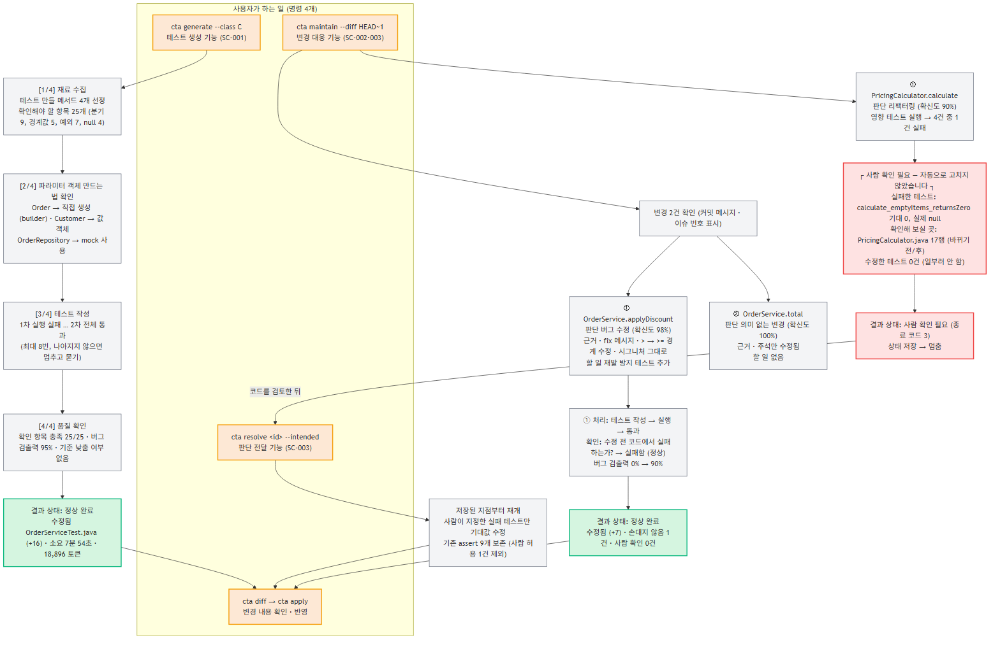
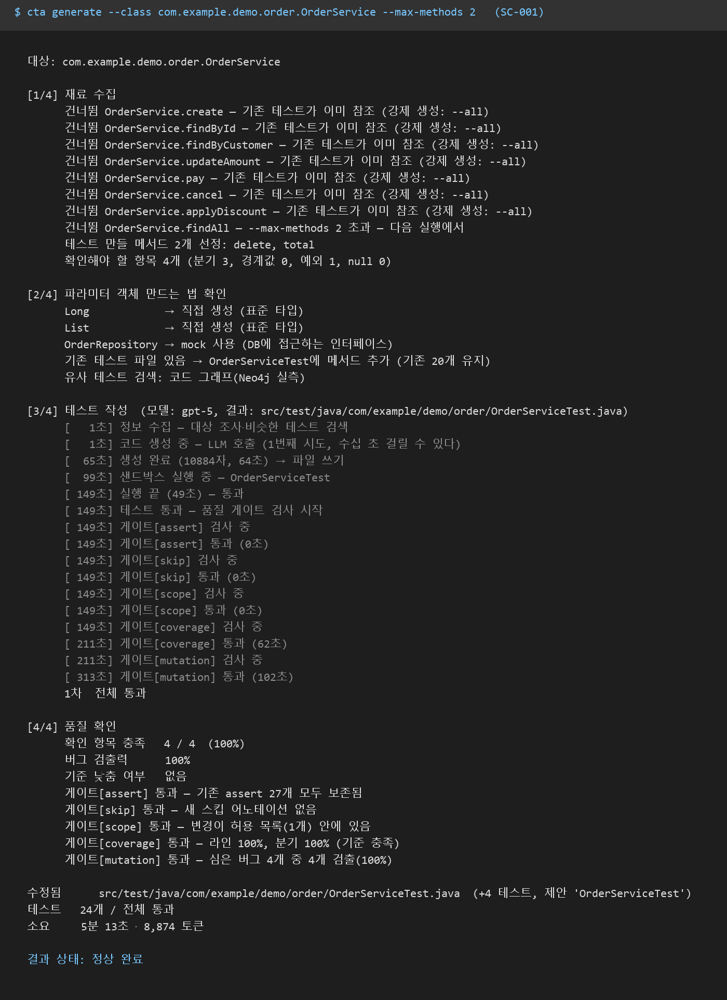
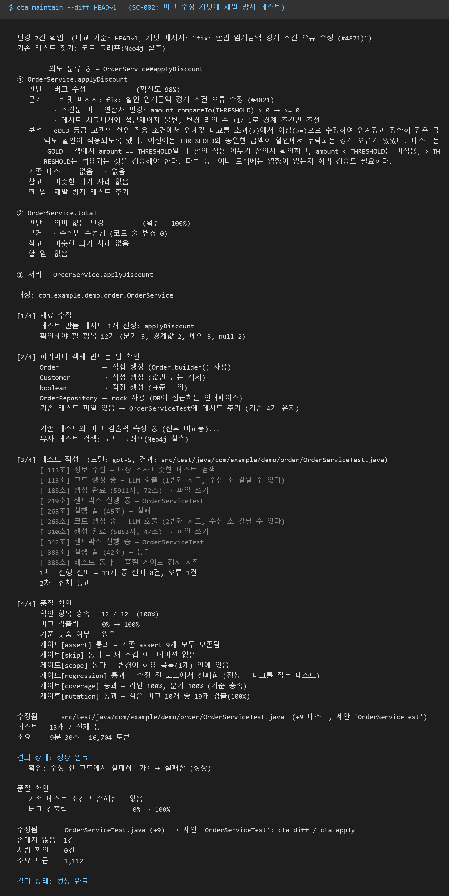
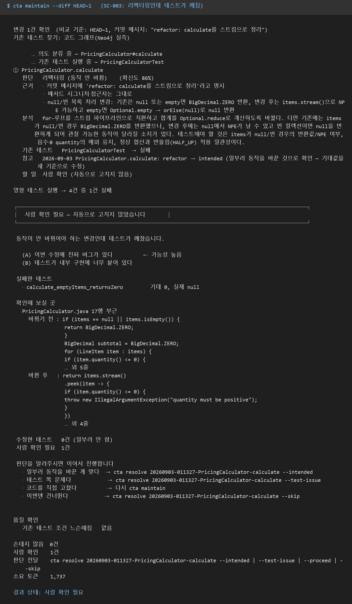
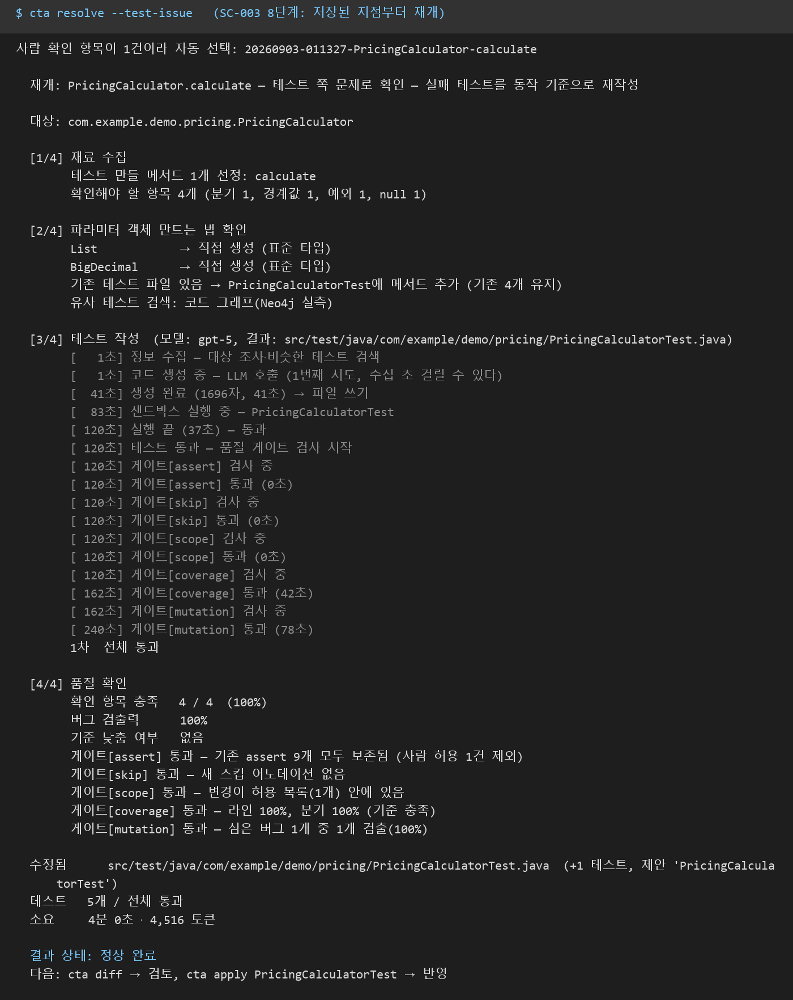
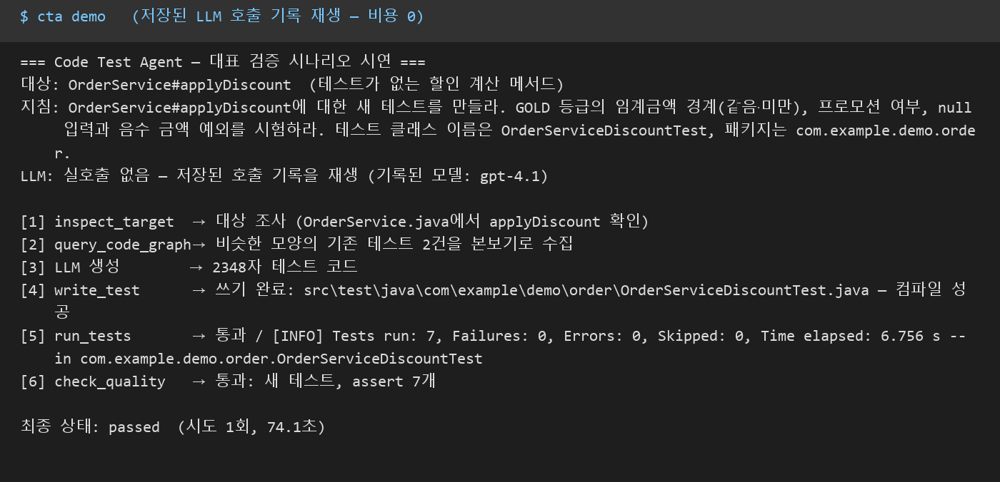

# Code Test Agent (`cta`) — PoC 구현 산출물

Java 코드가 바뀌면 그에 맞는 JUnit 테스트를 만들고 고쳐 주는 CLI 에이전트다.
LLM은 두 곳(변경 의도 판단, 테스트 코드 작성)에만 쓰고, 안전장치(규칙표·게이트 6종)는 전부 일반 코드다.
명령은 `시나리오수립.md`의 기능 이름과 1:1로 대응하고, 모든 실측은 Neo4j 코드 그래프·Docker 샌드박스·
gpt-5(사내 게이트웨이)를 실제로 연결해 얻었다.

## 한눈에 보기

- **구현한 핵심 모듈**: 5단계 파이프라인(변경 추출 → 건별 의도 분류 → 규칙표 → LangGraph 작성 루프 → 게이트 6종 → 제안 보관) ·
  경량 Java 파서(정규식 + 중괄호 짝맞춤) · Neo4j 코드 그래프(DECLARES/CREATES/COVERS, 파싱 폴백) · 사람 개입 저장·재개(`cta resolve`) · LLM 호출 기록·재생
- **실제로 검증한 시나리오** (2026-09-03, gpt-5 + Docker + Neo4j 실연결, 실행 로그 원문은 [§4](#4-핵심-동작-검증)):
  SC-001 테스트 생성(1차 통과, +4) · SC-002 버그 수정 → 재발 방지 테스트(1차 실패 → 2차 통과, 수정 전 코드에서 실패 확인) ·
  SC-003 리팩터링인데 테스트 깨짐 → 사람 확인(종료 코드 3) → `resolve`로 재개(assert 9개 보존) · SC-004 assert 완화 차단 · 재생 시연(0 토큰)
- **확인된 한계**: 파서가 정규식 근사(제네릭·중첩 클래스) · COVERS는 테스트 클래스 단위 · CALLS 관계 없음 · 확신도는 표시용(분기 안 함) · 저장된 호출 기록이 예제 트리에 묶임
- **다음 Task 확장 범위**: 워크플로우에 상황별 스킬(테스트 작성 지식 묶음) 붙이기 → 전/후 수치 비교 · MCP 서버(같은 core) · 판단 메모 검색 · 멀티모듈 Maven
- **구현 범위 구분**(동작 확인 완료 / 제한적 동작 / 향후 확장)은 [§5](#5-구현-범위--동작-확인-완료--제한적-동작--향후-확장) 표, 모듈 간 데이터 계약은 [§2.0](#20-이-poc의-최소-계약)

| 항목 | 값 |
|---|---|
| 대상 | Java · Maven 단일 모듈 · JUnit 5 |
| 언어 / 프레임워크 | Python 3.11+ · LangGraph |
| LLM | 사내 게이트웨이 gpt-5 (Azure OpenAI 호환) |
| 실행 격리 | Docker 샌드박스 (네트워크 차단) |
| 코드 지식 | Neo4j 코드 그래프 (JaCoCo 실측) |
| 테스트 | 단위 172건 · Docker 통합 2건 · Neo4j 통합 1건 |
| 실측일 | 2026-09-03 (전 시나리오 gpt-5 + Docker + Neo4j 실연결) |

---

## 목차

1. [개요 — 무엇을 하나](#1-개요--무엇을-하나)
2. [핵심 구현 내용](#2-핵심-구현-내용) — 요약. 상세는 별도 문서 [핵심구현.md](핵심구현.md)
   2.0 이 PoC의 최소 계약 · 2.1 에이전트 워크플로우 · 2.2 도구 및 함수 연동 · 2.3 데이터 및 컨텍스트
3. [주요 문제 해결 및 기술 리서치](#3-주요-문제-해결-및-기술-리서치)
4. [핵심 동작 검증](#4-핵심-동작-검증) — 실행 로그 원문 포함
5. [구현 범위 — 동작 확인 완료 / 제한적 동작 / 향후 확장](#5-구현-범위--동작-확인-완료--제한적-동작--향후-확장)
6. [문서 지도 · 재현 명령](#6-문서-지도--재현-명령)

---

## 1. 개요 — 무엇을 하나

개발자가 겪는 상황을 명령 하나씩으로 맡는다.

| 상황 | 명령 | 에이전트가 하는 일 | 시나리오 |
|---|---|---|---|
| 테스트가 없는 클래스를 고쳐야 한다 | `cta generate --class <클래스> --max-methods N` | 테스트 없는 메서드를 골라 실제로 실행되는 테스트를 만든다 | SC-001 |
| 버그를 고치고 커밋했다 | `cta maintain --diff HEAD~1` | 변경 의도를 판단하고 재발 방지 테스트를 추가한다. 수정 전 코드에서 실패하는지까지 확인한다 | SC-002 |
| 리팩터링했는데 테스트가 깨졌다 | `cta maintain --diff HEAD~1` | 기대값을 고치지 않고 실패 내용과 의심 위치를 정리해 멈춘다 | SC-003 |
| 멈춘 항목에 답하고 싶다 | `cta resolve <id> --intended \| --test-issue \| --proceed \| --skip` | 저장된 지점부터 이어서 실행한다 | SC-003 |
| 결과를 보고 반영하고 싶다 | `cta diff` → `cta apply` | 제안을 보여 주고, 명령이 있을 때만 소스에 쓴다 | 공통 |
| 프로젝트를 미리 분석해 둔다 | `cta graph --coverage` | Neo4j에 코드 그래프를 만든다 (없으면 파싱 폴백) | 사전 조건 |

지키는 원칙 세 가지.

- **생성물은 제안이다.** `cta apply` 전에는 소스 트리가 바뀌지 않는다.
- **판단 근거를 숨기지 않는다.** 변경 건마다 판단·확신도·근거·할 일이 화면에 나온다.
- **기대값은 자동으로 고치지 않는다.** 리팩터링인데 테스트가 깨지면 사람에게 넘긴다.

**빠른 시작** — 준비물은 Python 3.11+, Docker(실행 중), 게이트웨이 API 키. Java·Maven은 컨테이너 안에서 돌므로 필요 없다.

```powershell
pip install <리포지토리>                       # 또는 pipx install
notepad $env:USERPROFILE\.cta\.env            # CTA_GATEWAY_URL / CTA_GATEWAY_API_KEY / CTA_LLM_MODEL=gpt-5

cd <Maven 프로젝트>
cta graph --coverage                           # (선택) Neo4j에 코드 그래프
cta generate --class com.example.order.OrderService --max-methods 4
cta diff                                       # 제안 검토
cta apply                                      # 반영
```

첫 실행은 의존성 준비(다운로드 + 예열)로 5분쯤 걸리고, 이후 `.cta/m2repo`에 캐시된다. 전체 명령과 옵션은 `docs/사용가이드.md`.

---

## 2. 핵심 구현 내용

> 자세한 내용은 별도 문서 **[핵심구현.md](핵심구현.md)** 에 있다 — 워크플로우 상세, 의도 분류 기법, 소스 파싱과
> 코드 그래프 저장 방식, 재료 수집, 도구·프롬프트, 게이트, 보관소를 단계별 예시와 함께 적었다. 여기서는 요약만 둔다.

층은 여섯 개이고 의존 방향은 아래로만 흐른다(`cli → adapters → core`). `core`는 `java`, `maven`, `junit` 같은
문자열을 가질 수 없고 이를 테스트(`tests/test_layering.py`)가 검사한다. 새 언어를 붙이려면 `adapters/` 폴더 하나를 더 만든다.

```
cli       명령 조립·화면 출력          cta generate / maintain / resolve / diff / apply / graph
adapters  Java·Maven·git을 아는 쪽      diff→메서드 매핑, 소스 파싱, 재료 수집, Docker 실행, 게이트 6종
core      언어를 모르는 순수 로직       규칙표, 작성 루프(LangGraph), 도구 6종, 데이터 모델
llm       LLM 호출의 유일한 통로        프롬프트 파일, 게이트웨이, 호출 기록·재생
graph     코드 그래프 모델·저장소       Neo4j / 인메모리, 질의 → 답 문장
sandbox   Docker 실행 래퍼              네트워크 차단, 마운트 통제
```

### 2.0 이 PoC의 최소 계약

모듈 경계를 건너는 데이터만 모았다. 이 표가 맞으면 E2E 단계의 MCP 서버도 같은 입출력으로 설계할 수 있다.
전체 정의는 [`docs/contracts.md`](../contracts.md), 필드명은 2026-09-06 코드 기준이다.

| 계약 | 핵심 필드 | 만드는 곳 → 쓰는 곳 | 정의 파일 |
|---|---|---|---|
| `ChangedSymbol` | `target`("Class#method") · `lines_added/removed` · `signature_changed` · `access_changed` · `comment_only` · `diff_excerpt` · `file_rel` · `change_line` | 변경 추출(git diff) → 의도 분류·화면 | `core/pipeline/models.py` |
| `ChangeSet` | `symbols: list[ChangedSymbol]` · `commit_message` · `issue_refs` | 변경 추출 → 의도 분류 단서 | 같음 |
| `Intent` | `category`(bug_fix / refactor / new_feature / trivial / unclear) · `confidence` 0~1 · `evidence` 목록 · `analysis` | LLM 1회(건별) → 규칙표·지침서·화면 | 같음 |
| `ActionDecision` | `kind`(create_test / no_action / escalate / ask) · `target` · `briefing`(작업 지침서) · `reason`(걸린 규칙표 행) | 규칙표 `(category, tests_status) → kind` → 작성 루프 또는 저장 | `core/pipeline/decide.py` |
| `WriterState` (LangGraph 상태) | `instruction` · `target` · `test_path` · `selector` · `context` · `extra_context` · `test_code` · `write_result` · `last_run` · `prev_run` · `attempts` · `quality` · `report` · `status`(working / passed / reported) · `history` | 조치 결정이 앞 5개를 채움 → 노드들이 갱신 → 게이트·보관소 | `core/writer_graph.py` |
| `RunResult` | `passed: bool` · `summary: str`(모델에게 그대로 보여줄 요약) | `TestRunner.run(selector)` → 도구 `run_tests` 문장 | `core/ports.py` |
| `GateResult` / `GateReport` | `name` · `passed` · `reason` / `results` 목록. 기준치 `GateConfig`(라인 0.80 · 분기 0.70 · 재시도 3 · 뮤테이션 0.5, `cta.toml`로 덮어씀) | 게이트 6종 → 탈락 사유를 지침서에 붙여 재생성, 통과면 제안 | `core/gates.py` |
| 코드 그래프 | 노드 `GraphNode{kind: Class \| Method, key, props}` · 엣지 `GraphEdge{kind: DECLARES \| CREATES \| COVERS, src, dst}`. Neo4j 저장은 단일 라벨 `CodeNode` + 관계 `REL{kind}` | `cta graph` 빌드 → 질의 3종(`verifying_tests` · `how_to_create` · `similar_tests`) → 문장(800토큰 상한) | `graph/model.py` · `graph/neo4j_store.py` |
| 도구 6종 | `inspect_target(target)` · `query_code_graph(query, target)` · `write_test(path, code)` · `run_tests(selector)` · `check_quality(path)` · `report_finding(finding)` — 전부 `-> str`(4,000자 상한), 예외 대신 문장 | 작성 루프 노드 → 포트(어댑터) | `core/tools/*.py` (1도구 1파일) |
| 저장 항목 `Escalation` | `id` · `kind`(escalate / ask) · `target` · `category` · `confidence` · `evidence` · `analysis` · `reason` · `briefing` · `tests` · `failed_tests[{name, expected, actual, message}]` · `diff_excerpt` · `base` · `status` | `maintain`이 멈출 때 저장 → `cta resolve`가 읽어 재개 | `cli/escalations.py` |
| 저장 항목 `Proposal` | `name` · `target` · `test_rel` · `status` · `gate_summary`(게이트별 한 줄) · `created_at` | 작성 루프 통과 → `cta diff` / `cta apply` | `cli/proposals.py` |

경계 규칙 두 줄. `core`는 `target`·`selector`를 불투명 문자열로만 다루고 문법 해석은 어댑터가 한다. LLM은 `TestCodeGenerator.generate(instruction, context, current_code, last_failure)`와 `IntentClassifier.classify(change, change_set, memos)` 두 포트 뒤에만 있다.

### 2.1 에이전트 워크플로우 (Agent Workflow)

* **구현 기능:** 5단계 파이프라인(의도 분류 → 규칙표 → 작성 루프 → 품질 게이트 → 제안 보관) +
  사람 개입 지점 2곳(저장 후 멈춤 → `cta resolve`로 재개) + 변경 건별 의도 분석 출력

**요약판** — 전체 흐름 한 장


보라 = LLM / 초록 = 일반 코드 안전장치(LLM 없음) / 주황 = 사람이 개입하거나 보는 곳

**상세판** — 작성 루프 안의 실패 분류·사용자 질문·한계 보고까지 현재 구현 그대로 (→ [핵심구현.md §1.2](핵심구현.md#12-상세판--현재-구현-그대로))


**사용자 관점** — 무엇을 치고, 무엇을 보고, 어디서 결정하는가



주황 = 사용자가 치는 명령 / 회색 = 화면에 나오는 것 / 초록 = 정상 완료 / 빨강 = 멈추고 사람에게 넘김

* **동작 원리** (요약 — 명령별 흐름·작성 루프의 노드 구성은 [핵심구현.md §1](핵심구현.md#1-에이전트-워크플로우))

  | 명령 | 흐름 | 시나리오 |
  |---|---|---|
  | `cta generate` | [1/4] 재료 수집 → [2/4] 객체 만드는 법 → [3/4] LLM 작성 + Docker 실행(최대 8회 자기 수정) → [4/4] 게이트 실측 | SC-001 |
  | `cta maintain` | ① 변경 추출 → ② 건별 의도 분류(LLM) → ③ 검증 테스트 실행 → ④ 규칙표 → ⑤ 테스트 추가 또는 저장하고 멈춤(종료 코드 3) | SC-002·003 |
  | `cta resolve` | 저장된 지점부터 같은 작성 루프로 재개. 사람이 지정한 실패 테스트만 assert 변경 허용 | SC-003 |

  규칙표에 **"기대값을 자동으로 고친다"는 행이 없다**는 점이 핵심이다. LLM의 분석 문장은 작업 지침서 내용만 채우고
  길은 못 바꾼다. 작성 루프는 LangGraph 상태 그래프이고, 사용자 질문은 `interrupt`로 그 자리에서 멈췄다 재개한다.

* **주요 기술:** LangGraph(StateGraph·interrupt·상태 저장소 checkpointer), gpt-5(사내 게이트웨이), 인터페이스(포트)/구현(어댑터) 분리
  (Fake 교체로 단위 테스트 172건이 LLM·Docker 없이 실행)

### 2.2 도구(Tool) 및 함수 연동

* **구현 기능:** 에이전트 도구 6종 + 재료 수집 + 네트워크 차단 실행 환경 + 게이트 6종 + 보관소 3종


* **동작 원리** (요약 — 도구별 입출력·게이트별 검사 방법은 [핵심구현.md §4~6](핵심구현.md#4-재료-수집--테스트를-쓰기-전에-일반-코드가-모으는-것))

  - **의도 분류 기법**: 규칙 기반 단서 수집(git diff·log에서 메서드 선언 변경·접근 제어자·줄 수·커밋 메시지·이슈 번호) →
    주석만 바뀐 변경은 LLM 없이 확정 → 변경 한 건당 LLM 1회, JSON(판단·확신도·근거·분석)으로만 응답 →
    깨진 응답은 unclear로 처리 → 규칙표 조회. 학습 모델·임베딩 없음 (→ [§2](핵심구현.md#2-의도-분류--어떤-기법을-썼나))
  - **소스 파싱**: 전용 구문 트리(AST) 파서 대신 정규식으로 메서드 선언 줄 찾기 + 중괄호 짝맞춤의 경량 파서 하나를 변경 추출·재료 수집·
    유사 테스트 검색·그래프 빌드·assert 게이트가 공유한다 (→ [§3](핵심구현.md#3-소스-코드-파싱과-코드-그래프-저장))
  - **재료 수집**: 확인 항목(분기·경계값·예외·null)과 객체 생성법(직접 생성/builder/mock)을 일반 코드가 세어 프롬프트 재료로 준다
  - **도구 6종**: inspect_target · query_code_graph · write_test · run_tests · check_quality · report_finding.
    반환은 예외 대신 "모델이 읽을 문장"(상한 4,000자)
  - **게이트 6종**(전부 일반 코드): assert(메서드 단위 전/후 + 엄격함 점수) · skip · scope(해시) · coverage(JaCoCo 80/70) ·
    mutation(PIT) · regression(수정 전 코드에서 실패해야 통과). 탈락 사유를 지침서에 붙여 재생성(최대 3회)
  - 그 밖의 장치: 전체 테스트 실행 금지 / 네트워크 차단 Docker + 읽기 전용 캐시 / 소스 트리에 닿는 곳은 `cta apply` 하나 /
    실행 도중 예외가 나도 생성물을 되돌린다

* **주요 기술:** Docker(`--network none`, 읽기 전용 마운트), Maven go-offline + 예열, JaCoCo, PIT(+junit5 플러그인), Mockito(대상 앱)

### 2.3 데이터 및 컨텍스트 (RAG & Context)

* **구현 기능:** Neo4j 코드 그래프(실측 연결, 파싱 폴백) + 유사 테스트 본보기 검색 + 판단 메모 + LLM 호출 기록·재생

* **동작 원리** (요약 — 그래프 스키마·Cypher·질의는 [핵심구현.md §3.4~3.7](핵심구현.md#34-그래프-모델--노드-2종-엣지-3종), 보관소는 [§7](핵심구현.md#7-데이터컨텍스트))
  - **코드 그래프에는 확정 관계만** 넣는다: DECLARES(정적) / CREATES(정적, `new` 구문) / COVERS(**JaCoCo 실측**).
    Neo4j에는 단일 라벨 `CodeNode` + 단일 관계 `REL{kind}`로 저장해 모든 Cypher가 고정 문자열 + 파라미터다.
    데모 프로젝트 실측: 클래스 13, 메서드 65, 엣지 97. 접속이 안 되면 파싱 폴백으로 내려가며 어느 쪽인지 화면에 표시한다
  - **판단 메모**: `cta resolve`의 결정을 저장하고 같은 메서드·클래스의 사례를 다음 `maintain`의 "참고"로 보여준다 —
    참고일 뿐 규칙표를 우회하지 못한다
  - **호출 기록·재생**: 모든 LLM 호출은 한 계층만 경유하고 요청·응답(토큰 수 포함)을 JSON으로 저장한다 → `cta demo`·자동 테스트는
    재생(비용 0, 매번 같은 결과). 기록 없으면 실패 — 몰래 실호출 금지
  - **시크릿**: 게이트웨이 주소·키는 `.env`(gitignore)로만 — 커밋 전 diff에서 키 모양 문자열을 검사

* **주요 기술:** Neo4j 5(샌드박스 밖 별도 컨테이너), Azure OpenAI 호환 게이트웨이(usage 토큰 합산), `.env` 시크릿 분리

---

## 3. 주요 문제 해결 및 기술 리서치

| 이슈 구분 | 문제 상황 및 원인 | 리서치 및 해결 과정 |
|---|---|---|
| **프롬프트** | 의도 분류가 변경 전체를 묶어 1회 판정 — 사용자는 "왜 이 조치인가"를 볼 수 없었고, 여러 변경이 섞이면 한 분류로 뭉개짐 | • **리서치:** 시나리오 문서의 기대 출력(변경별 판단·확신도·근거) 대조 <br>• **적용:** 변경 건별 JSON(category/confidence/evidence/analysis) 호출 + 단서를 일반 코드가 수집·표시 |
| **프롬프트** | 리팩터링 커밋의 diff에서 모델이 "동작이 바뀐 것 같다"며 **unclear(87%)**로 도망 → 질문 상자로 가 시나리오 흐름(refactor+실패=사람 확인)이 안 나옴 | • **리서치:** v4 2.1 — 의도(작성자가 하려던 것)와 동작 보존 판정(테스트 실행)의 역할 분리 <br>• **적용:** "category는 작성자의 의도, 보존 여부는 기존 테스트가 판정 — 의심 지점은 근거에 적어라" → refactor(86~90%) + 근거에 의심 지점 → 규칙표가 사람 확인으로 |
| **프롬프트** | 자기 수정 루프가 수렴하지 않음 — 실패 로그만 주면 같은 코드를 다시 생성 | • **적용:** 직전 코드+실패 로그 재주입, "같은 실패 2회 = 사람에게" 고정 분기(LLM 없음) → SC-001 실측 2차에 수렴 |
| **도구 연동** | 게이트웨이 응답 대기 120초 초과 — gpt-5가 메서드 4개짜리 테스트 파일(9,500자)을 만드는 데 100초+ | • **적용:** 상한 300초 + `CTA_GATEWAY_TIMEOUT`, 소켓 시간 초과를 안내 문구로 변환 |
| **도구 연동** | 재발 방지 테스트가 정말 그 버그를 잡는지 알 수 없음 — 고친 코드에서 통과하는 것만 확인 | • **리서치:** 시나리오 SC-002 7단계, 회귀 테스트의 정의(버그 버전에서 실패) <br>• **적용:** 게이트 regression — 변경 파일을 git의 수정 전 내용으로 바꿔 끼워 실행, 통과하면 탈락·재생성 |
| **데이터** | 그래프 경로로 SC-003을 돌리자 `calculate`의 검증 테스트가 엉뚱한 `OrderServiceTest`로 나옴 — JaCoCo 실행 기록이 이전 실행분에 덧붙여지는 기본값(append) 때문에 직전 게이트 실행 기록이 섞임. 커버리지 게이트 수치도 부풀릴 수 있는 결함 | • **리서치:** jacoco-maven-plugin `append`, surefire `testFailureIgnore` <br>• **적용:** `-Djacoco.append=false`로 매번 새로 기록, 깨진 테스트도 실행 기록은 남기도록 `-Dmaven.test.failure.ignore=true` → COVERS 16→12(오염 제거), `PricingCalculatorTest → 실패 → 사람 확인` 정확히 도출 |
| **데이터** | Neo4j 드라이버는 접속 없이 생성되므로 서버가 꺼져 있으면 폴백이 질의 시점에 예외로 터짐 | • **적용:** 생성 직후 확인 질의로 접속을 검사하는 공용 입구(`graph_access`) → generate·maintain 모두 실물/폴백을 같은 규칙으로 고르고 화면에 표시 |
| **데이터** | 생성 결과를 apply하자 저장된 호출 기록 재생(`cta demo`)이 깨짐 — 예제의 기존 테스트가 늘어 "비슷한 테스트" 본보기가 달라짐 | • **적용:** 요청 전문 대조는 유지(결정성), 예제 트리를 바꾸면 기록을 다시 만든다(대본 모드, 비용 0) |
| **안전장치** | 사람이 "일부러 바꿨다"고 답하면 기대값을 고쳐야 하는데, assert 게이트가 모든 변경을 막음 | • **리서치:** R3의 범위 — 금지 대상은 *사람 확인 없는* 자동 갱신 <br>• **적용:** 사람이 이름을 지정한 실패 테스트만 게이트 허용 목록에, 나머지 assert는 계속 보호. 실측: "기존 assert 9개 모두 보존됨 (사람 허용 1건 제외)" |
| **안전장치** | 모델이 게이트를 편법 우회 — 전체 경로 표기 `@Disabled`, assert 완화 | • **적용:** 전체 경로 허용 정규식 + assert **내용** 비교, 탈락 사유를 테스트 메서드 단위 "바뀌기 전/후 (점수)"로 보고(SC-004), 불변식 테스트로 상시 검증 |
| **결함 점검** | 검증 테스트 클래스가 대상과 다른 패키지에 있으면 새 파일이 엉뚱한 곳에 생김 — 패키지로만 경로를 계산해 "기존 파일에 추가"가 조용히 실패 | • **적용:** 테스트 트리에서 이름으로 먼저 찾는다(`locate_test_file`) + 단위 테스트 |
| **결함 점검** | 실행 중 예외(시간 초과·Ctrl+C·Docker 오류)가 나면 생성물이 소스 트리에 남음 — 복구가 정상 종료 경로에만 있었음 | • **적용:** 예외 시에도 기존 파일은 원문으로, 새 파일은 삭제로 되돌린 뒤 다시 던진다 |

---

## 4. 핵심 동작 검증

대상: `examples/demo` — Spring Boot 3.3 주문 CRUD 앱(OrderService·OrderRepository·PricingCalculator, Mockito 테스트).
사전 조건으로 `cta graph --coverage`를 실행해 Neo4j에 코드 그래프(클래스 13, 메서드 65, 엣지 97)를 만들어 두었다.
캡처는 실제 실행 로그를 그대로 그린 것이다(`scripts/render_capture.py`). 실측일 2026-09-03.

| 검증 | 시나리오 | 명령 | 결과 | 소요 |
|---|---|---|---|---|
| 1 | SC-001 | `generate --max-methods 2` | delete·total 선정, 그래프에서 본보기 검색, 1차 통과, 게이트 5종 통과(검출력 4/4), +4 테스트 | 5분 13초 · 8,874 토큰 |
| 1' | SC-001 | `generate --max-methods 4` | 확인 항목 25개, 1차 실패 → 2차 통과, +16 테스트, 검출력 95% | 7분 54초 · 18,896 토큰 |
| 2 | SC-002 | `maintain --diff HEAD~1` | 버그 수정 98% + 근거 3줄, 주석 변경은 LLM 없이 판정, +9 테스트, **regression 통과**, 검출력 0% → 100% | 9분 30초 · 17,816 토큰 |
| 3 | SC-003 | `maintain --diff HEAD~1` | COVERS로 검증 테스트 발견 → 1건 실패 → 리팩터링 86% → 사람 확인(종료 코드 3) | 1,737 토큰 |
| 4 | SC-003 | `resolve --test-issue` | 실패 테스트 1건만 재작성, assert 9개 보존, 검출력 100% | 4분 0초 · 4,516 토큰 |
| 5 | SC-004 | 단위 불변식 테스트 | assert 완화·삭제 → 탈락, 사유를 "바뀌기 전/후 (점수)"로 보고 | — |
| 6 | 재생 | `cta demo` | 저장된 기록으로 7개 테스트 생성·통과 | 74초 · 0 토큰 |

**[검증 1 — SC-001 테스트 생성]**

* **입력:** `cta generate --class com.example.demo.order.OrderService --max-methods 2`
* **에이전트 동작:**
  1. 재료 수집 — 기존 테스트가 참조하는 메서드 7개를 건너뛰고 `delete`·`total`을 선정, 확인 항목 4개 열거
  2. 객체 만드는 법 — `OrderRepository`는 mock, 값 객체는 직접 생성으로 판단
  3. 코드 그래프에서 유사 테스트 본보기 검색 → 프롬프트에 첨부 → LLM이 테스트 파일 작성
  4. Docker에서 컴파일·방금 만든 테스트만 실행 → 1차 통과
  5. 게이트 5종 통과 (커버리지 100/100, 검출력 4/4)
* **최종 결과:** +4 테스트(총 24), 정상 완료(종료 코드 0), 5분 13초 · 8,874 토큰. 제안은 `.cta/proposals/`에 저장, `cta diff`로 확인

실행 로그 원문 (가운데 건너뜀 목록만 줄임):

```text
$ cta generate --class com.example.demo.order.OrderService --max-methods 2

대상: com.example.demo.order.OrderService

[1/4] 재료 수집
      건너뜀 OrderService.create — 기존 테스트가 이미 참조 (강제 생성: --all)
      건너뜀 OrderService.findById — 기존 테스트가 이미 참조 (강제 생성: --all)
      … (같은 사유 5건) …
      건너뜀 OrderService.findAll — --max-methods 2 초과 — 다음 실행에서
      테스트 만들 메서드 2개 선정: delete, total
      확인해야 할 항목 4개 (분기 3, 경계값 0, 예외 1, null 0)

[2/4] 파라미터 객체 만드는 법 확인
      Long            → 직접 생성 (표준 타입)
      List            → 직접 생성 (표준 타입)
      OrderRepository → mock 사용 (DB에 접근하는 인터페이스)
      기존 테스트 파일 있음 → OrderServiceTest에 메서드 추가 (기존 20개 유지)
      유사 테스트 검색: 코드 그래프(Neo4j 실측)

[3/4] 테스트 작성 (모델: gpt-5, 결과: src/test/java/com/example/demo/order/OrderServiceTest.java)
      [   1초] 정보 수집 — 대상 조사·비슷한 테스트 검색
      [   1초] 코드 생성 중 — LLM 호출 (1번째 시도, 수십 초 걸릴 수 있다)
      [  65초] 생성 완료 (10884자, 64초) → 파일 쓰기
      [  99초] 샌드박스 실행 중 — OrderServiceTest
      [ 149초] 실행 끝 (49초) — 통과
      [ 149초] 테스트 통과 — 품질 게이트 검사 시작
      [ 149초] 게이트[assert] 통과 (0초)
      [ 149초] 게이트[skip] 통과 (0초)
      [ 149초] 게이트[scope] 통과 (0초)
      [ 211초] 게이트[coverage] 통과 (62초)
      [ 313초] 게이트[mutation] 통과 (102초)
      1차   전체 통과

[4/4] 품질 확인
      확인 항목 충족   4 / 4  (100%)
      버그 검출력      100%
      기준 낮춤 여부   없음
      게이트[assert] 통과 — 기존 assert 27개 모두 보존됨
      게이트[skip] 통과 — 새 스킵 어노테이션 없음
      게이트[scope] 통과 — 변경이 허용 목록(1개) 안에 있음
      게이트[coverage] 통과 — 라인 100%, 분기 100% (기준 충족)
      게이트[mutation] 통과 — 심은 버그 4개 중 4개 검출(100%)

수정됨    src/test/java/com/example/demo/order/OrderServiceTest.java  (+4 테스트, 제안 'OrderServiceTest')
테스트    24개 / 전체 통과
소요      5분 13초 · 8,874 토큰

결과 상태: 정상 완료
```

<details><summary>캡처 이미지</summary>


</details>

같은 명령을 `--max-methods 4`로 돌린 실측: 확인 항목 25개, 1차 실행 실패 → 실패 로그+직전 코드로 2차 통과, +16 테스트, 검출력 95%, 7분 54초 · 18,896 토큰.

**[검증 2 — SC-002 버그 수정 커밋 → 재발 방지 테스트]**

* **입력:** `cta maintain --diff HEAD~1` (`> 0` → `>= 0` 경계 수정 커밋 + 주석만 바뀐 메서드 1건)
* **에이전트 동작:**
  1. 변경 추출 — 메서드 2건(`applyDiscount`, `total`)과 단서(fix 커밋 메시지, 이슈 #4821, 연산자 변경, 메서드 선언 불변 +1/-1)
  2. 의도 분류 — `applyDiscount`는 "버그 수정 (확신도 98%)" + 근거 3줄. `total`은 주석만 바뀌어 LLM 없이 "의미 없는 변경 (100%)"
  3. 기존 테스트 — COVERS 실측상 `applyDiscount`를 검증하는 테스트 없음(none)
  4. 규칙표 — 버그 수정 × none → create_test / 의미 없는 변경 → 할 일 없음
  5. 작성 루프 — 1차 Mockito 오류 → 2차 통과 → 게이트 6종. **regression: 수정 전 코드에서 실패함 → 통과**
* **최종 결과:** 재발 방지 테스트 +9(확인 항목 12/12), 버그 검출력 0% → 100%, 정상 완료, 9분 30초 · 16,704 토큰(생성) + 1,112(분류)

실행 로그 원문. 읽는 순서는 `①② 의도 분류(LLM JSON을 화면 형식으로)` → `할 일`(규칙표 행 `bug_fix × none → create_test`) → `[3/4]` 1차 실패·2차 통과 → `[4/4]` 게이트 6종 → 종료:

```text
$ cta maintain --diff HEAD~1

변경 2건 확인 (비교 기준: HEAD~1, 커밋 메시지: "fix: 할인 임계금액 경계 조건 오류 수정 (#4821)")
기존 테스트 찾기: 코드 그래프(Neo4j 실측)

      … 의도 분류 중 — OrderService#applyDiscount
① OrderService.applyDiscount
   판단    버그 수정            (확신도 98%)
   근거    · 커밋 메시지: fix: 할인 임계금액 경계 조건 오류 수정 (#4821)
           · 조건문 비교 연산자 변경: amount.compareTo(THRESHOLD) > 0 → >= 0
           · 메서드 시그니처와 접근제어자 불변, 변경 라인 수 +1/-1로 경계 조건만 조정
   분석    GOLD 등급 고객의 할인 적용 조건에서 임계값 비교를 초과(>)에서 이상(>=)으로 수정하여
           임계값과 정확히 같은 금액도 할인이 적용되도록 했다. … 테스트는 GOLD 고객에서
           amount == THRESHOLD일 때 할인 적용 여부가 참인지 확인하고, amount < THRESHOLD는 미적용,
           > THRESHOLD는 적용되는 것을 검증해야 한다. …
   기존 테스트   없음  → 없음
   참고    비슷한 과거 사례 없음
   할 일   재발 방지 테스트 추가

② OrderService.total
   판단    의미 없는 변경        (확신도 100%)
   근거    · 주석만 수정됨 (코드 줄 변경 0)
   참고    비슷한 과거 사례 없음
   할 일   없음

① 처리 — OrderService.applyDiscount

대상: com.example.demo.order.OrderService

[1/4] 재료 수집
      테스트 만들 메서드 1개 선정: applyDiscount
      확인해야 할 항목 12개 (분기 5, 경계값 2, 예외 3, null 2)

[2/4] 파라미터 객체 만드는 법 확인
      Order           → 직접 생성 (Order.builder() 사용)
      Customer        → 직접 생성 (값만 담는 객체)
      boolean         → 직접 생성 (표준 타입)
      OrderRepository → mock 사용 (DB에 접근하는 인터페이스)
      기존 테스트 파일 있음 → OrderServiceTest에 메서드 추가 (기존 4개 유지)

      기존 테스트의 버그 검출력 측정 중 (전후 비교용)...
      유사 테스트 검색: 코드 그래프(Neo4j 실측)

[3/4] 테스트 작성 (모델: gpt-5, 결과: src/test/java/com/example/demo/order/OrderServiceTest.java)
      [ 113초] 정보 수집 — 대상 조사·비슷한 테스트 검색
      [ 113초] 코드 생성 중 — LLM 호출 (1번째 시도, 수십 초 걸릴 수 있다)
      [ 185초] 생성 완료 (5911자, 72초) → 파일 쓰기
      [ 219초] 샌드박스 실행 중 — OrderServiceTest
      [ 263초] 실행 끝 (45초) — 실패
      [ 263초] 코드 생성 중 — LLM 호출 (2번째 시도, 수십 초 걸릴 수 있다)
      [ 310초] 생성 완료 (5853자, 47초) → 파일 쓰기
      [ 342초] 샌드박스 실행 중 — OrderServiceTest
      [ 383초] 실행 끝 (42초) — 통과
      [ 383초] 테스트 통과 — 품질 게이트 검사 시작
      1차   실행 실패 — 13개 중 실패 0건, 오류 1건
      2차   전체 통과

[4/4] 품질 확인
      확인 항목 충족   12 / 12  (100%)
      버그 검출력      0% → 100%
      기준 낮춤 여부   없음
      게이트[assert] 통과 — 기존 assert 9개 모두 보존됨
      게이트[skip] 통과 — 새 스킵 어노테이션 없음
      게이트[scope] 통과 — 변경이 허용 목록(1개) 안에 있음
      게이트[regression] 통과 — 수정 전 코드에서 실패함 (정상 — 버그를 잡는 테스트)
      게이트[coverage] 통과 — 라인 100%, 분기 100% (기준 충족)
      게이트[mutation] 통과 — 심은 버그 10개 중 10개 검출(100%)

수정됨    src/test/java/com/example/demo/order/OrderServiceTest.java  (+9 테스트, 제안 'OrderServiceTest')
테스트    13개 / 전체 통과
소요      9분 30초 · 16,704 토큰

결과 상태: 정상 완료
   확인: 수정 전 코드에서 실패하는가? → 실패함 (정상)

품질 확인
   기존 테스트 조건 느슨해짐   없음
   버그 검출력                 0% → 100%

수정됨      OrderServiceTest.java (+9)  → 제안 'OrderServiceTest': cta diff / cta apply
손대지 않음 1건
사람 확인   0건
소요 토큰   1,112

결과 상태: 정상 완료
```

<details><summary>캡처 이미지</summary>


</details>

**[검증 3 — SC-003 리팩터링인데 테스트가 깨짐 → 사람 확인]**

* **입력:** `cta maintain --diff HEAD~1` (for문 → 스트림 변환, 빈 목록 처리 누락 커밋)
* **에이전트 동작:**
  1. 변경 추출 — `PricingCalculator.calculate` 1건
  2. 기존 테스트 — COVERS 실측으로 `PricingCalculatorTest`를 찾아 Docker 실행 → 4건 중 1건 실패
  3. 의도 분류 — "리팩터링 (확신도 86%)" + 근거에 빈 목록 처리 변경 의심 지점
  4. 규칙표 — 리팩터링 × 실패 → 사람 확인. 기대값은 건드리지 않음
  5. 사람 확인 상자 출력 — 실패 테스트 `calculate_emptyItems_returnsZero`(기대 0, 실제 null), 확인해 보실 곳 17행, 선택지. "참고" 줄에 직전 `resolve`의 판단 메모
* **최종 결과:** 상태를 `.cta/escalations/`에 저장하고 멈춤, 종료 코드 3

실행 로그 원문. 규칙표 행은 `refactor × fail → escalate`이고 화면에는 `할 일  사람 확인 (자동으로 고치지 않음)`으로 나온다:

```text
$ cta maintain --diff HEAD~1

변경 1건 확인 (비교 기준: HEAD~1, 커밋 메시지: "refactor: calculate를 스트림으로 정리")
기존 테스트 찾기: 코드 그래프(Neo4j 실측)

      … 의도 분류 중 — PricingCalculator#calculate
      … 기존 테스트 실행 중 — PricingCalculatorTest
① PricingCalculator.calculate
   판단    리팩터링 (동작 안 바뀜)    (확신도 86%)
   근거    · 커밋 메시지에 'refactor: calculate를 스트림으로 정리'라고 명시
           · 메서드 시그니처·접근자는 그대로
           · null/빈 목록 처리 변경: 기존은 null 또는 empty면 BigDecimal.ZERO 반환, 변경 후는
             items.stream()으로 NPE 가능하고 empty면 Optional.empty → orElse(null)로 null 반환
   분석    for-루프를 스트림 파이프라인으로 치환하고 합계를 Optional.reduce로 계산하도록 바꿨다.
           다만 기존에는 items가 null/빈 경우 BigDecimal.ZERO를 반환했으나, 변경 후에는 null에서
           NPE가 날 수 있고 빈 컬렉션이면 null을 반환하게 되어 관찰 가능한 동작이 달라질 소지가 있다. …
   기존 테스트   PricingCalculatorTest  → 실패
   참고    2026-09-03 PricingCalculator.calculate: refactor → intended (일부러 동작을 바꾼 것으로 확인 —
           기대값을 새 기준으로 수정)
   할 일   사람 확인 (자동으로 고치지 않음)

영향 테스트 실행 → 4건 중 1건 실패

┌──────────────────────────────────────────────┐
│  사람 확인 필요 — 자동으로 고치지 않았습니다  │
└──────────────────────────────────────────────┘

동작이 안 바뀌어야 하는 변경인데 테스트가 깨졌습니다.

  (A) 이번 수정에 진짜 버그가 있다        ← 가능성 높음
  (B) 테스트가 내부 구현에 너무 붙어 있다

실패한 테스트
  · calculate_emptyItems_returnsZero        기대 0, 실제 null

확인해 보실 곳
  PricingCalculator.java 17행 부근
    바뀌기 전 : if (items == null || items.isEmpty()) {
                    return BigDecimal.ZERO;
                }
                BigDecimal subtotal = BigDecimal.ZERO;
                for (LineItem item : items) {
                … 외 5줄
    바뀐 후   : return items.stream()
                .peek(item -> {
                    if (item.quantity() <= 0) {
                        throw new IllegalArgumentException("quantity must be positive");
                … 외 4줄

수정한 테스트    0건 (일부러 안 함)
사람 확인 필요   1건

판단을 알려주시면 이어서 진행합니다
  · 일부러 동작을 바꾼 게 맞다  → cta resolve 20260903-011327-PricingCalculator-calculate --intended
  · 테스트 쪽 문제다            → cta resolve 20260903-011327-PricingCalculator-calculate --test-issue
  · 코드를 직접 고쳤다          → 다시 cta maintain
  · 이번엔 건너뛴다             → cta resolve 20260903-011327-PricingCalculator-calculate --skip

품질 확인
   기존 테스트 조건 느슨해짐   없음

손대지 않음  0건
사람 확인    1건
판단 전달    cta resolve 20260903-011327-PricingCalculator-calculate --intended | --test-issue | --proceed | --skip
소요 토큰    1,737

결과 상태: 사람 확인 필요
```

<details><summary>캡처 이미지</summary>


</details>

**[검증 4 — SC-003 8단계 판단 전달 후 재개]**

* **입력:** `cta resolve --test-issue` (저장된 항목 1건을 자동 선택)
* **에이전트 동작:**
  1. 저장된 지점을 읽어 같은 작성 루프로 재개. 사람이 지정한 실패 테스트 1건만 assert 변경 허용 목록에 추가
  2. LLM이 그 테스트만 동작 기준으로 다시 작성 → Docker 실행 통과
  3. 게이트 — assert 게이트가 나머지 9개를 보존했는지 확인, 검출력 100%
  4. 결정을 판단 메모(`.cta/memos/`)로 기록
* **최종 결과:** 제안 저장, 4분 0초 · 4,516 토큰. `--intended`로 재개한 실측도 같은 형태(기대값 1건만 수정)였다

실행 로그 원문 (게이트 진행 줄 일부 줄임):

```text
$ cta resolve --test-issue

사람 확인 항목이 1건이라 자동 선택: 20260903-011327-PricingCalculator-calculate

  재개: PricingCalculator.calculate — 테스트 쪽 문제로 확인 — 실패 테스트를 동작 기준으로 재작성

  대상: com.example.demo.pricing.PricingCalculator

  [1/4] 재료 수집
        테스트 만들 메서드 1개 선정: calculate
        확인해야 할 항목 4개 (분기 1, 경계값 1, 예외 1, null 1)

  [2/4] 파라미터 객체 만드는 법 확인
        List            → 직접 생성 (표준 타입)
        BigDecimal      → 직접 생성 (표준 타입)
        기존 테스트 파일 있음 → PricingCalculatorTest에 메서드 추가 (기존 4개 유지)
        유사 테스트 검색: 코드 그래프(Neo4j 실측)

  [3/4] 테스트 작성 (모델: gpt-5, 결과: src/test/java/com/example/demo/pricing/PricingCalculatorTest.java)
        [   1초] 코드 생성 중 — LLM 호출 (1번째 시도, 수십 초 걸릴 수 있다)
        [  41초] 생성 완료 (1696자, 41초) → 파일 쓰기
        [  83초] 샌드박스 실행 중 — PricingCalculatorTest
        [ 120초] 실행 끝 (37초) — 통과
        [ 120초] 테스트 통과 — 품질 게이트 검사 시작
        … 게이트[assert]·[skip]·[scope] 통과 (각 0초) …
        [ 162초] 게이트[coverage] 통과 (42초)
        [ 240초] 게이트[mutation] 통과 (78초)
        1차   전체 통과

  [4/4] 품질 확인
        확인 항목 충족   4 / 4  (100%)
        버그 검출력      100%
        기준 낮춤 여부   없음
        게이트[assert] 통과 — 기존 assert 9개 모두 보존됨 (사람 허용 1건 제외)
        게이트[skip] 통과 — 새 스킵 어노테이션 없음
        게이트[scope] 통과 — 변경이 허용 목록(1개) 안에 있음
        게이트[coverage] 통과 — 라인 100%, 분기 100% (기준 충족)
        게이트[mutation] 통과 — 심은 버그 1개 중 1개 검출(100%)

  수정됨    src/test/java/com/example/demo/pricing/PricingCalculatorTest.java  (+1 테스트, 제안 'PricingCalculatorTest')
  테스트    5개 / 전체 통과
  소요      4분 0초 · 4,516 토큰

  결과 상태: 정상 완료
  다음: cta diff → 검토, cta apply PricingCalculatorTest → 반영
```

<details><summary>캡처 이미지</summary>


</details>

**[검증 5 — SC-004 assert 완화 차단]** (단위 불변식 테스트, Fake)

* **입력:** `assertEquals(8500 …)` → `assertNotNull(…)` 완화 + 예외 테스트 삭제가 들어간 생성물
* **에이전트 동작:** assert 게이트가 테스트 메서드 단위로 전/후를 비교해 탈락시키고, 사유를 시나리오 형식으로 만들어 재생성 지침에 붙인다. 재시도 3회 소진 시 "품질 미달"(종료 코드 2)로 사람 확인 제안이 남는다
* **최종 결과** (게이트 탈락 사유 원문):

```
applyDiscount_goldMember_appliesRate
  바뀌기 전 : 결과가 정확히 new BigDecimal("8500")인지 확인   (4점)
  바뀐 후   : 결과가 null이 아닌지만 확인   (1점)
applyDiscount_negativeAmount_throws
  예외가 나는지 확인하는 테스트가 통째로 삭제됨
```

**[검증 6 — 재생 시연]**

* **입력:** `cta demo` (LLM 비용 0)
* **에이전트 동작:** 저장된 LLM 호출 기록으로 대표 시나리오를 재생 — 요청 전문이 기록과 같아야 응답을 돌려주므로 매번 같은 결과
* **최종 결과:** 7개 테스트 생성·통과, 74초 · 0 토큰



---

## 5. 구현 범위 — 동작 확인 완료 / 제한적 동작 / 향후 확장

"완료"는 §4의 실측 번호나 자동 테스트 파일을 근거로 댈 수 있는 것만 넣었다. 근거가 없으면 "제한적"으로 내렸다.

**동작 확인 완료** — 실측 또는 자동 테스트로 확인됨

| 항목 | 근거 |
|---|---|
| 5단계 파이프라인 (변경 추출 → 건별 의도 분류 → 규칙표 → 작성 루프 → 게이트 → 제안) | 검증 2·3, `tests/test_pipeline.py`, `test_maintain_core.py` |
| 의도 분류 — 변경 건당 LLM 1회, JSON(판단·확신도·근거·분석), 주석만 변경은 LLM 없이 trivial | 검증 2(98% / 100%), 검증 3(86%) |
| 규칙표 — "기대값 자동 갱신" 행 없음, unclear는 표 조회 전 ask | 검증 2·3, `test_pipeline.py` |
| LangGraph 작성 루프 — 직전 코드+실패 재주입, 소프트 4회·하드 8회 상한, 실패 분류 3종 | 검증 1'·2(1차 실패 → 2차 통과), `test_writer_graph.py` |
| interrupt 저장 → `cta resolve` 재개, 사람이 지정한 실패 테스트 1건만 assert 변경 허용 | 검증 3·4, `test_submit_and_interrupt.py`, `test_escalation_flow.py` |
| 게이트 6종 (assert 메서드 단위 전/후 · skip · scope · coverage 80/70 · mutation · regression) | 검증 1·2·4·5, `test_gate_invariants.py`, `pytest -m docker` |
| Neo4j 코드 그래프 DECLARES/CREATES/COVERS(JaCoCo 실측) + 질의 3종 + 접속 실패 시 파싱 폴백 | 검증 1~4(Neo4j 실측 경로), `test_graph.py`, `test_graph_neo4j.py`, `test_graph_access.py` |
| 제안 보관 → `cta diff` / `cta apply`, apply 전 소스 트리 불변, 예외 시 생성물 되돌림 | `test_proposals.py`, `test_file_mode.py` |
| LLM 호출 기록·재생 (기록 없으면 실패, 실호출 폴백 없음) | 검증 6(0 토큰), `test_llm_replay.py` |
| Docker 샌드박스 네트워크 차단, 빈 selector 거부(전체 실행 금지) | `test_fake_adapters.py`, `test_java_adapter_docker.py` |
| `core/`에 언어 문자열 없음 | `test_layering.py` |

**제한적으로 동작** — 돌아가지만 근사·폴백·조건부

| 항목 | 한계 |
|---|---|
| 경량 Java 파서 (정규식 + 중괄호 짝맞춤) | 제네릭·중첩 클래스·어노테이션 많은 코드에서 메서드 경계를 놓칠 수 있다. AST 파서 전환은 후순위 |
| 확인 항목·객체 생성법 추정 | 같은 파서 위의 근사. 확인 항목 수는 재료일 뿐 정확한 분기 수가 아니다 |
| COVERS 엣지 | 테스트 **클래스** 단위 실측. 메서드 단위 연결은 비용이 커서 미룸 |
| 그래프 질의 | 6종 이름 중 3종(`verifying_tests` · `how_to_create` · `similar_tests`)만 답한다. 나머지는 안내 문장 |
| 파싱 폴백 | `similar_tests`만 파싱으로 답하고, 검증 테스트 찾기는 "클래스명 + `메서드(` 호출 모양"의 근사 |
| 확신도 | 모델이 매긴 값. 보정된 확률이 아니라 화면 표시용이고 코드는 이 값으로 분기하지 않는다 |
| 저장된 LLM 호출 기록 | 요청 전문 대조라 예제 트리를 바꾸면 기록을 다시 만들어야 한다 |
| 게이트웨이 응답 시간 | 큰 파일은 100초+. 상한 300초(`CTA_GATEWAY_TIMEOUT`)로 막지만 근본 해결은 아니다 |
| 뮤테이션 기준치 0.5 | 임시값. 평가 하네스 수치로 보정 예정 |
| 프로젝트 형태 | Maven 단일 모듈만. 멀티모듈·Gradle 미지원 |

**향후 확장 예정** — 다음 Task 후보

| 항목 | 왜 |
|---|---|
| 워크플로우에 상황별 스킬 붙이기 (Mockito·회귀 테스트 등 지식 묶음을 규칙으로 선택해 프롬프트에 주입) | 현재 프롬프트는 고정 2파일. 1차 실패(검증 1'·2)를 줄일 수 있는지 전/후 수치로 확인 |
| CALLS 관계 | 정적으로 100% 확정되지 않아 confidence를 붙여야 한다 |
| 메서드 단위 COVERS | 검증 테스트를 더 좁게 고를 수 있다 |
| MCP 서버 | 같은 core를 CLI와 공유. Claude Code 등에서 도구로 호출 |
| 판단 메모 임베딩 검색 | 지금은 같은 메서드·클래스 이름 일치만. 참고용 불변식(규칙표 우회 불가)은 유지 |
| 멀티모듈 Maven, 대화 압축, 설정 파일 확장 | 3단계 범위 |

---

## 6. 문서 지도 · 재현 명령

| 문서 | 내용 |
|---|---|
| `docs/제출자료/핵심구현.md` | 핵심 구현 상세 — 워크플로우(요약·상세), 의도 분류 기법, 소스 파싱·코드 그래프 저장, 재료 수집, 도구·게이트·보관소 |
| `docs/제출자료/diagrams/*.mmd` | 워크플로우 그림 원본(mermaid). `python scripts/render_diagram.py <mmd> <png>`로 PNG 재생성 |
| `docs/사용가이드.md` | 설치, `.env`, 명령·옵션, 문제 해결 |
| `docs/의도분류.md` | 의도 분류의 단계·프롬프트·파싱·규칙표를 주니어 기준으로 |
| `docs/코드그래프.md` | Neo4j 그래프 스키마·질의 예시 |
| `docs/architecture.md` | 층 구조·모듈 표 |
| `docs/contracts.md` | 데이터 모델·인터페이스·게이트 함수 정의 |
| `docs/adr/` | 설계 결정 기록 (ADR-0015: 시나리오 정합) |
| `docs/hardening-notes.md` | 작업·실측·발견 기록 |
| `docs/제출자료/시나리오수립.md` | 핵심 사용자 시나리오 SC-001~004 |
| `examples/demo/README.md` | 예제 앱 구성과 시나리오 재현 절차 |

```
cta graph --coverage                  # Neo4j에 코드 그래프 빌드 (JaCoCo 실측 COVERS 포함)
cta demo                              # 대표 시나리오를 저장된 LLM 호출 기록으로 재생 (비용 0)
pytest -q                             # 단위 172건 — 파이프라인·게이트·재료 수집·렌더링 전부 Fake로 검증
pytest -m docker / pytest -m neo4j    # Docker 통합(재생·게이트 불변식) / Neo4j 왕복
python scripts/demo_scenarios.py bugfix|refactor <폴더>   # SC-002/003 재현용 저장소
```
