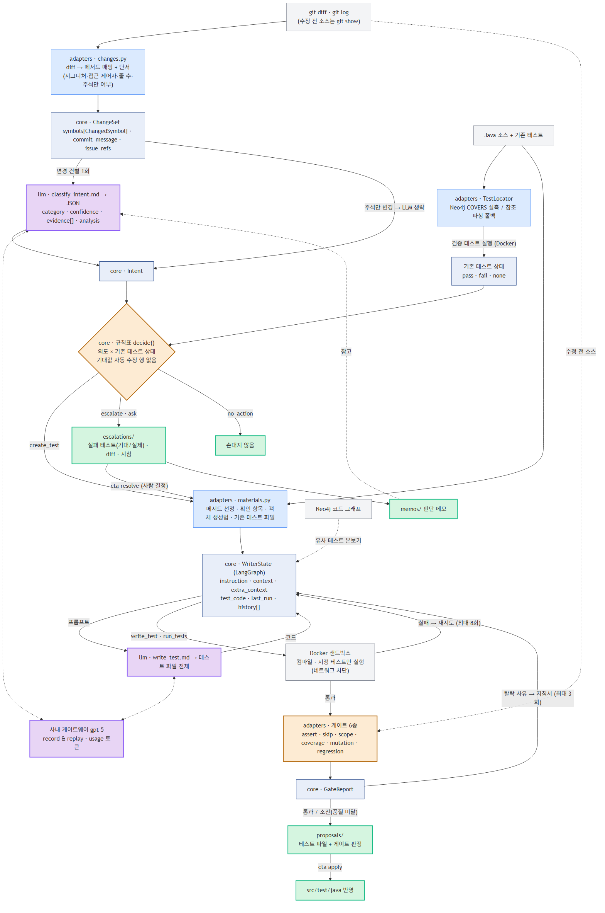

# Code Test Agent — 구현 산출물

**한 줄 요약**: Java 코드 변경에 맞는 JUnit 테스트를 자동 생성·유지보수하는 CLI 도구(`cta`).
LLM은 두 곳(의도 분류·테스트 작성)에만 쓰고, 안전장치(규칙표·게이트 6종)는 전부 일반 코드다.
명령은 `시나리오수립.md`의 기능 이름과 1:1로 대응하고, 모든 실측은 Neo4j 코드 그래프·Docker 샌드박스·
gpt-5(사내 게이트웨이)를 실제로 연결해 얻었다(2026-09-03).

| 시나리오 기능 | 명령 | 시나리오 |
|---|---|---|
| 테스트 생성 기능 | `cta generate --class <클래스> --max-methods N` | SC-001 |
| 변경 대응 기능 | `cta maintain --diff <기준 커밋>` | SC-002 · SC-003 |
| 판단 전달 기능 | `cta resolve <id> --intended \| --test-issue \| --proceed \| --skip` | SC-003 |
| 변경 내용 확인 / 반영 기능 | `cta diff` / `cta apply` | 공통 |
| 프로젝트 분석 기능 | `cta graph --coverage` | 사전 조건 |

---

## 1. 에이전트 워크플로우 — 두 관점

### 1.1 사용자 관점 — 무엇을 치고, 무엇을 보고, 어디서 결정하는가


주황 = 사용자가 치는 명령 4개 / 회색 = 화면에 그대로 출력되는 것 / 초록 = 정상 완료 / 빨강 = 멈추고 사람에게 넘김

- **테스트 생성(SC-001)**: 명령 하나로 `[1/4] 재료 수집 → [2/4] 객체 만드는 법 → [3/4] 테스트 작성 → [4/4] 품질 확인`이
  차례로 출력되고, 마지막에 `결과 상태`와 소요 시간·토큰이 나온다. 사용자는 `cta diff`로 보고 `cta apply`로 반영한다
- **변경 대응(SC-002)**: 변경 **건마다** `판단 (확신도) / 근거 / 분석 / 기존 테스트 / 참고 / 할 일`이 출력된다 —
  왜 이 조치인지 사용자가 읽을 수 있다. 버그 수정이면 재발 방지 테스트를 만들고 **수정 전 코드에서 실패하는지**까지 확인한다
- **리팩터링인데 테스트가 깨짐(SC-003)**: 상자로 "자동으로 고치지 않았습니다"를 알리고 실패 테스트(기대/실제)와
  확인해 보실 곳을 보여준 뒤 **저장하고 멈춘다**(종료 코드 3). 사용자가 코드를 검토한 뒤 `cta resolve`로 판단을
  전달하면 저장된 지점부터 이어 간다

### 1.2 데이터 흐름 관점 — 무엇이 어디를 거쳐 어디에 남는가



파랑 = core(언어를 모르는 순수 로직) / 하늘 = adapters(Java를 아는 쪽) / 보라 = LLM 통로 / 주황 = 결정적 안전장치 / 초록 = 보관소

- git diff는 `ChangeSet`(메서드 단위 심볼 + 커밋 메시지·이슈 번호·시그니처·접근 제어자·줄 수 단서)이 되고,
  건별로 LLM에 가서 `Intent`(분류·확신도·근거·분석)가 된다. 주석만 바뀐 심볼은 LLM을 거치지 않는다
- 검증 테스트는 Neo4j의 COVERS(JaCoCo 실측)에서 찾아 Docker에서 실행하고, 그 상태(pass/fail/none)와 `Intent`가
  **규칙표**에 들어가 `ActionDecision`이 된다 — 여기엔 LLM도, "기대값 자동 수정" 행도 없다
- create_test는 재료(확인 항목·객체 생성법·기존 테스트 파일)를 실어 LangGraph `WriterState`로 들어가고,
  LLM 생성 → Docker 컴파일·실행 → 게이트 6종을 거쳐 `proposals/`에 남는다. escalate/ask는 `escalations/`에 남고
  `cta resolve`가 같은 작성 루프로 이어 간다. 사람의 결정은 `memos/`에 남아 다음 분류의 참고가 된다
- 소스 트리(`src/test/java`)에 닿는 것은 `cta apply` 한 곳뿐이다

---

## 2. 핵심 구현 내용

**2.1 에이전트 워크플로우**

* **구현 기능**: 5단계 파이프라인 + 사람 개입 지점 2곳(저장 후 멈춤 → 재개) + 변경 건별 의도 분석 출력


* **동작 원리**
  - **의도 분류는 변경 건마다 LLM 1회**. 단서는 일반 코드가 수집해 프롬프트와 화면에 같이 넣는다. 프롬프트는
    "category는 작성자의 의도, 동작 보존 여부는 기존 테스트 실행이 판정한다 — 의심 지점은 근거에 적어라"
  - 조치 결정은 규칙표 조회 — LLM 분석은 지침서 내용만 채우고 **길은 못 바꾼다**. 리팩터링+테스트 실패 = 무조건 사람에게
  - **사람 개입은 저장 후 멈춤**: `cta resolve --intended`는 **사람이 지정한 실패 테스트만** 기대값 수정을 허용하고
    나머지 assert는 게이트가 계속 보호한다. 결정은 판단 메모로 남아 다음 실행의 "참고" 줄에 나온다
  - 작성 루프는 실패 로그+직전 코드를 다음 프롬프트에 넣어 자기 수정(최대 8회, 4회마다 사용자 확인)
* **주요 기술**: LangGraph(StateGraph·interrupt·checkpointer), gpt-5(사내 게이트웨이), 포트/어댑터 구조
  (Fake 교체로 단위 테스트 171건이 LLM·Docker 없이 실행)

**2.2 도구(Tool) 및 함수 연동**

* **구현 기능**: 에이전트 도구 6종 + 재료 수집 + 인터넷 차단 실행 환경 + 게이트 6종 + 보관소 3종


* **동작 원리**
  - 도구 반환은 예외 대신 "모델이 읽을 문장"(상한 4,000자) — 실패도 다음 행동의 재료가 된다
  - **재료 수집(일반 코드)**: 테스트 만들 메서드 선정(공개·미참조 메서드를 확인 항목 많은 순으로 N개), 확인 항목
    (분기·경계값·예외·null) 열거, 파라미터 객체 만드는 법(builder / 값 객체 / 저장소 mock), 기존 테스트 파일 첨부
  - 게이트 6종(전부 기계 검사, 테스트를 만든 에이전트는 판정 관여 불가):

  | 게이트 | 검사 방법 | 잡는 것 |
  |---|---|---|
  | assert | 테스트 메서드 단위 전/후 비교 + 엄격함 점수 | 기존 검증 삭제·완화 (assertEquals 4점 → assertNotNull 1점) |
  | skip | 어노테이션 카운트 | @Disabled 부착 (전체 경로 우회 포함) |
  | scope | 소스 전체 해시 대조 | 허용 목록 밖 수정 (대상 코드 조작) |
  | coverage | JaCoCo 실측 | 대상 라인 80%·분기 70% 미달 → 확인 항목 충족 수로 표시 |
  | mutation | PIT (복제 pom, 대상 메서드 집계) | 심은 버그를 못 잡는 빈 테스트 → 버그 검출력 % (전후 비교) |
  | regression | 수정 전 소스로 바꿔 끼워 실행(git show) | 수정 전 코드에서도 통과하는 "버그를 못 잡는" 재발 방지 테스트 |

* **주요 기술**: Docker, Maven go-offline+예열, JaCoCo, PIT(+junit5 플러그인), Mockito(대상 앱)

**2.3 데이터 및 컨텍스트**

* **구현 기능**: Neo4j 코드 그래프(실측 연결, 파싱 폴백) + few-shot 예시 검색 + 판단 메모 + LLM 호출 녹화·재생
* **동작 원리**
  - 그래프에는 **확정 관계만**: 선언한다 / 만든다(정적 파싱) / 검증한다(**JaCoCo 실측**). 데모 프로젝트 실측:
    클래스 13, 메서드 65, 엣지 97. "이 메서드를 검증하는 테스트는?"이 실측 기반이라 "기존 테스트가 깨졌는가"의 근거가 된다.
    `generate`는 유사 테스트 본보기를, `maintain`은 검증 테스트를 그래프에서 찾고, 접속이 안 되면 파싱 폴백으로
    내려가며 어느 쪽인지 화면에 표시한다
  - 판단 메모: `cta resolve`의 결정을 저장하고 같은 메서드·클래스의 사례를 다음 `maintain`의 "참고"로 보여준다 —
    참고일 뿐 규칙표를 우회하지 못한다
  - 녹화·재생: 모든 LLM 호출은 한 계층 경유, 요청·응답(토큰 수 포함)을 JSON으로 저장 → `cta demo`·자동 테스트는
    재생(비용 0, 결정적). 기록 없으면 실패 — 몰래 실호출 금지
* **주요 기술**: Neo4j 5(샌드박스 밖 별도 컨테이너), Azure OpenAI 호환 게이트웨이(usage 토큰 합산), `.env` 시크릿 분리

---

## 3. 주요 문제 해결 및 기술 리서치

| 구분 | 문제 상황 및 원인 | 리서치 및 적용 |
|---|---|---|
| **프롬프트** | 의도 분류가 변경 전체를 묶어 1회 판정 — 사용자는 "왜 이 조치인가"를 볼 수 없었고, 여러 변경이 섞이면 한 분류로 뭉개짐 | • **리서치:** 시나리오 문서의 기대 출력(변경별 판단·확신도·근거) 대조 <br>• **적용:** 변경 건별 JSON(category/confidence/evidence/analysis) 호출 + 단서를 일반 코드가 수집·표시 |
| **프롬프트** | 리팩터링 커밋의 diff에서 모델이 "동작이 바뀐 것 같다"며 **unclear(87%)**로 도망 → 질문 상자로 가 시나리오 흐름(refactor+실패=escalate)이 안 나옴 | • **리서치:** v4 2.1 — 의도(작성자가 하려던 것)와 동작 보존 판정(테스트 실행)의 역할 분리 <br>• **적용:** "category는 작성자의 의도, 보존 여부는 기존 테스트가 판정 — 의심 지점은 근거에 적어라" → refactor(86~90%) + 근거에 의심 지점 → 규칙표 escalate |
| **프롬프트** | 자기 수정 루프가 수렴하지 않음 — 실패 로그만 주면 같은 코드를 다시 생성 | • **적용:** 직전 코드+실패 로그 재주입, "같은 실패 2회 = 사람에게" 결정적 분기 → SC-001 실측 2차에 수렴 |
| **도구 연동** | 게이트웨이 응답 대기 120초 초과 — gpt-5가 메서드 4개짜리 테스트 파일(9,500자)을 만드는 데 100초+ | • **적용:** 상한 300초 + `CTA_GATEWAY_TIMEOUT`, 소켓 시간 초과를 안내 문구로 변환 |
| **도구 연동** | 재발 방지 테스트가 정말 그 버그를 잡는지 알 수 없음 — 고친 코드에서 통과하는 것만 확인 | • **리서치:** 시나리오 SC-002 7단계, 회귀 테스트의 정의(버그 버전에서 실패) <br>• **적용:** 게이트 regression — 변경 파일을 git의 수정 전 내용으로 바꿔 끼워 실행, 통과하면 탈락·재생성 |
| **데이터** | 그래프 경로로 SC-003을 돌리자 `calculate`의 검증 테스트가 엉뚱한 `OrderServiceTest`로 나옴 — JaCoCo 실행 기록이 이전 실행분에 덧붙여지는 기본값(append) 때문에 직전 게이트 실행 기록이 섞임. 커버리지 게이트 수치도 부풀릴 수 있는 결함 | • **리서치:** jacoco-maven-plugin `append`, surefire `testFailureIgnore` <br>• **적용:** `-Djacoco.append=false`로 매번 새로 기록, 깨진 테스트도 실행 기록은 남기도록 `-Dmaven.test.failure.ignore=true` → COVERS 16→12(오염 제거), `PricingCalculatorTest → 실패 → 사람 확인` 정확히 도출 |
| **데이터** | Neo4j 드라이버는 접속 없이 생성되므로 서버가 꺼져 있으면 폴백이 질의 시점에 예외로 터짐 | • **적용:** 생성 직후 확인 질의로 접속을 검사하는 공용 입구(`graph_access`) → generate·maintain 모두 실물/폴백을 같은 규칙으로 고르고 화면에 표시 |
| **데이터** | 생성 결과를 apply하자 저장된 호출 기록 재생(`cta demo`)이 깨짐 — 예제의 기존 테스트가 늘어 "비슷한 테스트" 본보기가 달라짐 | • **적용:** 요청 전문 대조는 유지(결정성), 예제 트리를 바꾸면 기록을 다시 만든다(대본 모드, 비용 0) |
| **안전장치** | 사람이 "일부러 바꿨다"고 답하면 기대값을 고쳐야 하는데, assert 게이트가 모든 변경을 막음 | • **리서치:** R3의 범위 — 금지 대상은 *사람 확인 없는* 자동 갱신 <br>• **적용:** 사람이 이름을 지정한 실패 테스트만 게이트 허용 목록에, 나머지 assert는 계속 보호. 실측: "기존 assert 9개 모두 보존됨 (사람 허용 1건 제외)" |
| **안전장치** | 모델이 게이트를 편법 우회 — FQN `@Disabled`, assert 완화 | • **적용:** 전체 경로 허용 정규식 + assert **내용** 비교, 탈락 사유를 테스트 메서드 단위 "바뀌기 전/후 (점수)"로 보고(SC-004), 불변식 테스트로 상시 검증 |

---

## 4. 핵심 동작 검증 (실측 — Neo4j 그래프 + Docker + gpt-5, 2026-09-03)

대상: `examples/demo` — Spring Boot 3.3 주문 CRUD 앱(OrderService·OrderRepository·PricingCalculator, Mockito 테스트).
사전 조건으로 `cta graph --coverage`를 실행해 Neo4j에 코드 그래프(클래스 13, 메서드 65, 엣지 97)를 만들어 두었다.
아래 캡처는 실제 실행 로그를 그대로 그린 것이다(`scripts/render_capture.py`).

**검증 1 — SC-001 테스트 생성** `cta generate --class com.example.demo.order.OrderService --max-methods 2`

기존 테스트가 참조하는 메서드 7개를 건너뛰고 `delete`·`total`을 선정, 확인 항목 4개, 유사 테스트 본보기를
**그래프에서** 검색, 1차 통과 → 게이트 5종 통과(커버리지 100/100, 검출력 4/4) → +4 테스트(총 24), 5분 13초 · 8,874 토큰.


(같은 명령을 `--max-methods 4`로 처음 돌렸을 때: 25개 확인 항목, 1차 실행 실패 → 2차 통과, +16 테스트, 검출력 95%, 7분 54초 · 18,896 토큰)

**검증 2 — SC-002 버그 수정 커밋** `cta maintain --diff HEAD~1` (`>` → `>=` 경계 수정 + 주석만 바뀐 메서드 1건)

변경 2건: `applyDiscount`는 "버그 수정 (확신도 98%)" — 근거로 fix 커밋 메시지·이슈 #4821, `> 0 → >= 0` 연산자 변경,
시그니처·접근 제어자 불변(+1/-1)을 들었다. `total`은 주석만 바뀌어 LLM 없이 "의미 없는 변경 (100%)" → 할 일 없음.
COVERS 실측상 `applyDiscount`를 검증하는 테스트는 없음 → 재발 방지 테스트 +9(확인 항목 12/12), 1차 Mockito 오류 → 2차 통과,
**regression 게이트 통과(수정 전 코드에서 실패함)**, 버그 검출력 0% → 100%, 9분 30초 · 16,704 토큰(생성)+1,112(분류), 정상 완료.


**검증 3 — SC-003 리팩터링인데 테스트가 깨짐** `cta maintain --diff HEAD~1` (for문→스트림, 빈 목록 처리 누락 커밋)

COVERS 실측으로 `PricingCalculatorTest`를 찾아 실행 → 4건 중 1건 실패 → 판단 "리팩터링 (확신도 86%)" + 근거에
빈 목록 처리 변경 의심 → **사람 확인 상자**(실패 테스트 `calculate_emptyItems_returnsZero` 기대 0, 실제 null /
확인해 보실 곳 17행 / 선택지) → 상태 저장, 종료 코드 3. "참고" 줄에는 직전 `resolve`의 판단 메모가 나온다.


**검증 4 — SC-003 8단계 판단 전달** `cta resolve --test-issue`

저장된 항목을 자동 선택해 재개 → 실패했던 테스트 1건만 다시 작성(사람 허용), 나머지 assert 9개 보존, 검출력 100%,
4분 0초 · 4,516 토큰 → 제안 저장, 판단 메모 기록. `--intended`로 재개한 실측도 같은 형태(기대값 1건만 수정)였다.


**검증 5 — SC-004 assert 완화 차단** (단위 불변식 테스트, Fake)

`assertEquals(8500 …)` → `assertNotNull(…)` 완화와 예외 테스트 삭제를 넣으면 게이트가 탈락시키고 사유를
시나리오 형식으로 만든다. 재시도 3회 소진 시 결과 상태 "품질 미달"(종료 코드 2)로 사람 확인 제안이 남는다.

```
applyDiscount_goldMember_appliesRate
  바뀌기 전 : 결과가 정확히 new BigDecimal("8500")인지 확인   (4점)
  바뀐 후   : 결과가 null이 아닌지만 확인   (1점)
applyDiscount_negativeAmount_throws
  예외가 나는지 확인하는 테스트가 통째로 삭제됨
```

**검증 6 — 재생 시연** `cta demo` (LLM 비용 0)


**재현 명령**

```
cta graph --coverage                  # Neo4j에 코드 그래프 빌드 (JaCoCo 실측 COVERS 포함)
cta demo                              # 대표 시나리오를 저장된 LLM 호출 기록으로 재생 (비용 0)
pytest -q                             # 단위 171건 — 파이프라인·게이트·재료 수집·렌더링 전부 Fake로 검증
pytest -m docker / pytest -m neo4j    # Docker 통합(재생·게이트 불변식) / Neo4j 왕복
python scripts/demo_scenarios.py bugfix|refactor <폴더>   # SC-002/003 재현용 저장소
```
