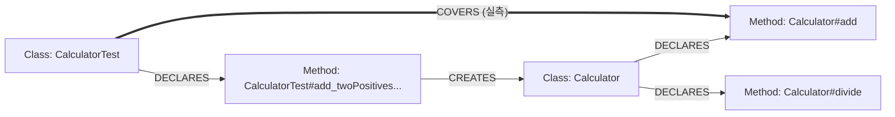

# 코드 그래프 — Neo4j 구성과 설계 이유

에이전트가 소스 코드 구조를 파악할 때 쓰는 그래프 DB의 구성, 그렇게 만든 이유,
얻는 효과를 정리한다. 구현: `cta/graph/`(모델·저장소·질의), `cta/adapters/java/`(빌더·실측).

## 1. 무엇인가 — 3줄 요약

1. 프로젝트의 클래스·메서드와 그 관계를 Neo4j에 저장해 두고, 에이전트의
   `query_code_graph` 도구가 질의한다
2. 저장하는 관계는 **100% 확정되는 것만** 3종 — 추측으로 만든 엣지는 없다
3. 핵심 용도: `cta run`이 "이 메서드를 검증하는 기존 테스트가 있는가, 통과하는가"를
   **실측 근거**로 판단하는 것

## 2. 그래프 구성 (스키마)

### 노드 2종

| 노드 | key 규칙 | 주요 속성 |
|---|---|---|
| Class | `Calculator` | package, is_test(테스트 트리 여부) |
| Method | `Calculator#divide` | class_name, name, param_count, uses_exception, is_test(@Test 여부), snippet(소스 발췌 600자) |

테스트 메서드를 별도 노드로 두지 않고 Method의 `is_test` 속성으로 구분한다 —
"테스트도 메서드다"로 두면 모양 비교 질의(파라미터 수·예외 유무)가 한 가지 코드로 끝난다.

### 엣지 3종 — 전부 확정 관계

| 엣지 | 방향 | 근거 | 예 |
|---|---|---|---|
| DECLARES | 클래스 → 메서드 | 정적 파싱 (소스에 적혀 있음) | `Calculator → Calculator#divide` |
| CREATES | 메서드 → 클래스 | 정적 파싱 (`new 클래스(` 구문, 프로젝트 안 클래스만) | `CalculatorTest#add_... → Calculator` |
| COVERS | 테스트 클래스 → 메서드 | **JaCoCo 커버리지 실측** (실제 실행 기록) | `CalculatorTest → Calculator#add` |

예시 — demo 프로젝트의 그래프 모양:



divide로 들어오는 COVERS 엣지가 없다 = "divide를 검증하는 테스트가 없다"가
그래프에서 바로 읽힌다.

## 3. 어떻게 채우나

```powershell
cta graph              # 정적 파싱만 (DECLARES·CREATES) — 수 초
cta graph --coverage   # + COVERS 실측 — 테스트 클래스마다 격리 실행이라 수 분
```

- **정적 2종**: 프로젝트 전체 .java를 파싱해 노드·DECLARES를 만들고, 메서드 본문의
  `new 클래스(` 구문에서 CREATES를 뽑는다. 외부 라이브러리 생성(`new ArrayList()` 등)은
  프로젝트 안 클래스가 아니므로 버린다 — 잡음 제거
- **COVERS**: 테스트 클래스를 하나씩 Docker 샌드박스에서 JaCoCo 계측과 함께 실행하고,
  커버리지 기록(jacoco.xml)에서 "라인이 실제로 실행된 메서드"를 뽑아 엣지로 만든다.
  실행 실패·리포트 없음이면 엣지를 만들지 않는다 — 빈 것이 틀린 엣지보다 낫다
- 빌드는 프로젝트 단위 전체 교체(지우고 다시 쓰기)다. 증분 갱신은 후순위

## 4. 왜 이렇게 설계했나

| 결정 | 이유 | 얻는 것 |
|---|---|---|
| **확정 관계만 저장** — 호출 관계(CALLS)처럼 정적으로 100% 확정 안 되는 것은 제외 | 그래프는 조치 결정의 입력이다. 틀린 엣지 하나가 "기존 테스트 있음/없음" 판단을 오염시키면 잘못된 자동 조치로 이어진다 | "그래프에 있으면 사실이다"라는 신뢰. 없는 정보는 도구가 "inspect_target으로 확인하라"고 안내 |
| **COVERS는 실측** — 정적 호출 분석이 아니라 커버리지 기록 | "테스트 코드가 이 메서드를 호출하는 것 같다"는 리플렉션·DI·상속·간접 호출에서 틀린다. 실행 기록은 거짓말하지 않는다 | `cta run`의 "리팩터링인데 기존 테스트가 깨졌다 → 사람에게" 판단(안전장치 R3)의 근거가 사실이 된다 |
| **질의는 사전 정의 6종만, 답 800토큰 상한** — 모델이 Cypher를 직접 쓰지 못한다 | 모델 작성 쿼리는 주입·폭주·비용 문제가 있고, 긴 답은 프롬프트를 밀어낸다 | 결정적·안전한 도구 반환. 답은 "짧은 요약 + 다음 행동 안내" 형태 유지 |
| **단일 라벨(CodeNode)·단일 관계(REL) + kind 속성** — `:Class`, `:DECLARES` 같은 동적 라벨을 안 쓴다 | Neo4j는 라벨·관계 타입을 파라미터로 못 받아, 종류별 라벨을 쓰면 Cypher 문자열 조립이 필요해진다(주입 위험·쿼리 캐시 미스) | 모든 Cypher가 고정 문자열 + 파라미터. `project` 속성으로 여러 프로젝트가 한 DB에 공존 |
| **저장소는 포트(GraphStore)** — 인메모리 구현과 Neo4j 구현을 갈아끼운다 | 그래프 로직 테스트에 실제 DB가 필요하면 느리고 불안정하다 | 단위 테스트는 인메모리로 결정적으로 돌고, Neo4j 연동은 통합 테스트(neo4j 마커)로 분리 |
| **그래프는 필수가 아니다** — 없으면 파싱 폴백·보수적 동작 | 설치 부담으로 도구 전체가 안 돌면 본말전도 | Neo4j 없이도 generate가 동작(유사 테스트는 파싱 검색). run은 "커버 테스트 없음"으로 보수적으로(사람에게 묻는 쪽) 동작 |
| **Neo4j는 샌드박스 밖 별도 컨테이너** | 테스트 실행 샌드박스는 네트워크 차단이 원칙 — DB를 그 안에 넣으면 격리 경계가 깨진다 | 격리 원칙(R6) 유지. 접속 정보는 `.env`로만 |

## 5. 뭐가 좋은가 — 파이프라인에서의 효과

질의 3종이 실제로 답하는 것 (나머지 3종은 후순위 — 안내 문장 반환):

| 질의 | 답 | 파이프라인에서의 쓰임 |
|---|---|---|
| verifying_tests | "이 메서드를 **실제로 실행하는** 테스트: CalculatorTest" | `cta run`이 그 테스트를 샌드박스에서 돌려 통과/실패를 확인 → 규칙표 입력 |
| how_to_create | "이 클래스를 생성하는 기존 코드" (테스트 코드 우선 정렬 + 발췌) | 새 테스트가 기존 생성 방법을 그대로 재사용 — 생성자 추측 제거 |
| similar_tests | 모양(파라미터 수·예외 유무)이 닮은 기존 테스트 2건 발췌 | few-shot 본보기로 프롬프트에 첨부 — 프로젝트 관례(이름·import) 준수 |

실측 검증 사례(demo 프로젝트): `verifying_tests(Calculator#add)` = CalculatorTest
(실측 일치), `verifying_tests(Calculator#divide)` = 없음(실제로 없음 — 정확).

## 6. 눈으로 확인하기 — Neo4j Browser

`http://localhost:7474` 접속(7474=웹 UI, 7687=드라이버 전용) 후:

```cypher
// 프로젝트 전체 그래프 보기
MATCH (n:CodeNode) RETURN n LIMIT 100

// 실측 COVERS 엣지만 보기 (테스트 → 메서드)
MATCH (t:CodeNode)-[r:REL {kind:'COVERS'}]->(m:CodeNode) RETURN t, r, m

// 특정 메서드를 검증하는 테스트 찾기 (에이전트의 verifying_tests와 같은 질의)
MATCH (t:CodeNode)-[:REL {kind:'COVERS'}]->(m:CodeNode {key:'Calculator#add'})
RETURN t.key
```

## 7. 알려진 한계와 후순위

- **COVERS 귀속은 테스트 "클래스" 단위** — 메서드 단위 귀속은 메서드별 격리 실행이
  필요해 비용이 크다. 필요성이 보이면 평가 하네스로 비용 대비 효과를 재고 결정
- **key에 패키지 생략, 오버로드는 key 충돌** — 단일 모듈 소규모 프로젝트 전제.
  충돌이 실제로 문제 되면 파라미터 시그니처를 key에 넣는다
- **CALLS(호출) 엣지 없음** — 확정이 안 되는 관계라 제외. 도입한다면 확신도
  (confidence) 속성을 붙여 "추측임"을 표시하는 방식으로 (후순위)
- **증분 갱신 없음** — 빌드는 전체 교체. 코드가 많이 바뀌면 `cta graph --coverage` 재실행
